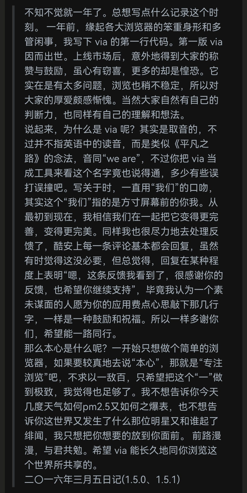

[Gitee](https://gitee.com/daybreak166/ViaBrowserCollection)|GitHub • [意见反馈](https://github.com/daybreak1929/ViaBrowserCollection/issues) • [更新日志](https://github.com/daybreak1929/ViaBrowserCollection/commits/main/)

> ⚠此收藏合集涵盖内容较多，部分收藏内容并非仅限via浏览器可以使用;本人无iOS设备，如是iOS版用户还请自行尝试能否使用

*****

## 💡项目目录

> [问答与使用技巧](cn/FAQ.md)(含问题排障、效果解析、使用技巧、相应限制等)

> [油猴脚本集介绍](cn/script-share.md)(含greasyfork站点的脚本集、相关脚本的介绍推荐及via中相关的设置)

> [奇奇怪怪的推荐](cn/messy-cont.md)(包含广告拦截规则、浏览器标识、搜索引擎、网站推荐等)

> [via的小功能或冷门知识](cn/via-help.md)(包含一些功能效果、主页功能、图标包和其他可自定义部分)

*****

## 💡项目外链

via官方的[QQ频道 ](https://pd.qq.com/s/142yif2dj)| [TG群组](https://t.me/+bMMIgOk0cnA3YjI9)

via官网的[Android版via常见问题文档](https://viayoo.com/zh-cn/docs/via-for-android-faq.html)|[使用webdav同步数据](https://viayoo.com/zh-cn/docs/sync-your-data-via-webdav.html)|[Scheme介绍文档](https://viayoo.com/zh-cn/docs/about-the-uri-scheme-of-via-for-android.html)

[chrome与via同步书签(千寻博客)](https://blog.qianxun.site/教程/pc端chrome使用floccus扩展和移动端via同步书签/)

[via浏览器各版本的拾穗整理(SGFOX博客)](https://www.sgfox.cc/archives/via-shisui.html)

[via历史版本(官方版，豌豆荚链接)](https://m.wandoujia.com/apps/6609177/history)

AndroidWebview下载：[谷歌商店](https://play.google.com/store/apps/details?id=com.google.android.webview) |[ 国内下载站](https://m.downkuai.com/android/167450.html)(确保[谷歌服务框架](http://m.3673.com/down/7083.html)和[谷歌商店](http://m.3673.com/down/17484.html)能正常运行或登录)

[15版本的HuaweiWebview(123盘)](https://www.123pan.com/s/OuOKVv-Q2I63.html)(相当于AndroidWebview114版本)

*****

## 💡后话

> “希望via能长久地同你浏览这个世界所共享的” 
 
 详细展开 
  

> 正如开发者所构想的那般，Via仍走在简的路上探索。但相比从前，用户也在不断涌入，目前在酷安上已是1千万下载的量级，也有、也需要诸如[谷花泰](http://www.coolapk.com/u/486230)、[达蒙山](http://www.coolapk.com/u/1563443)、[undefined303](http://www.coolapk.com/u/4023639)、[耗子Sky](http://www.coolapk.com/u/1166187)以及其他无数制作教程合集的大佬们在为其保持活力。这就同v大所说“其实是取音的，音同‘we are’” “其实这个‘我们’指的是方寸屏幕前的你我”，我们正在共同构建起一个属于自己的“我们”，既然如此，我何不贡献自己的一份力呢？

特别鸣谢

[酷安@various](http://www.coolapk.com/u/441319) V大制作的Via浏览器[[酷安](https://www.coolapk.com/apk/mark.via)|[官网](https://viayoo.com)]