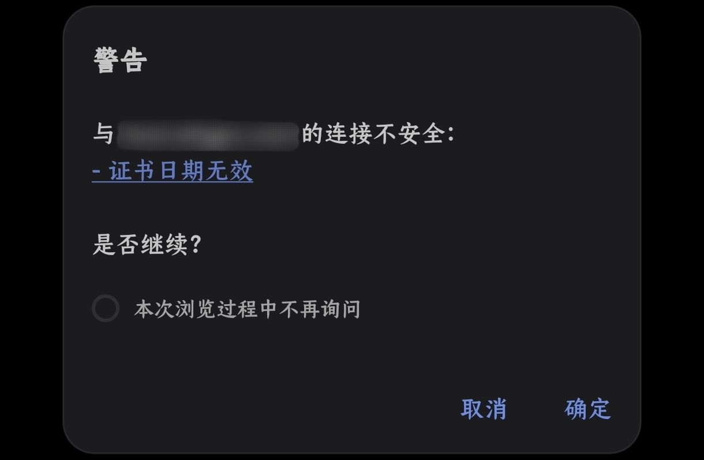
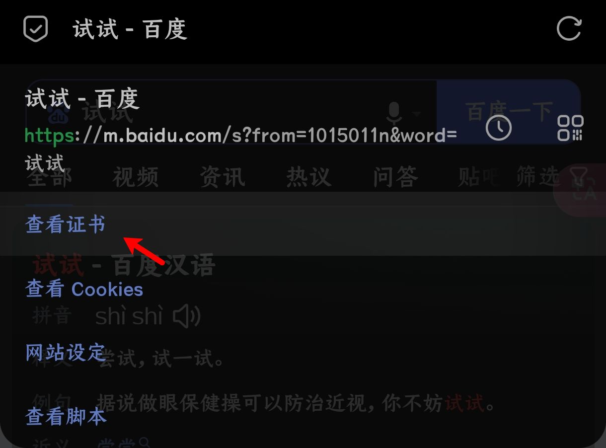
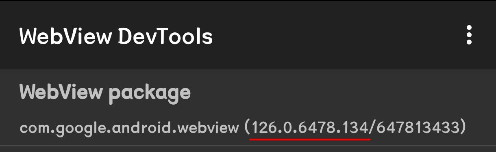
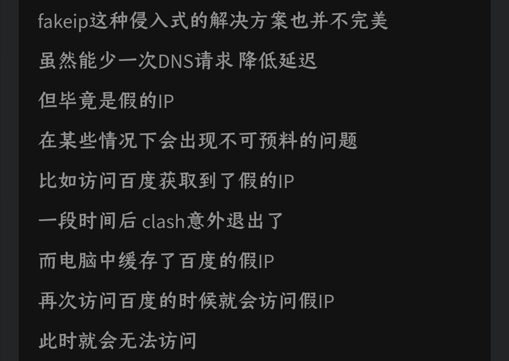
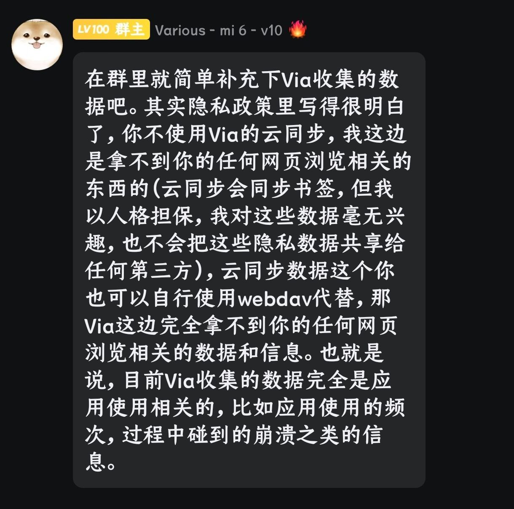
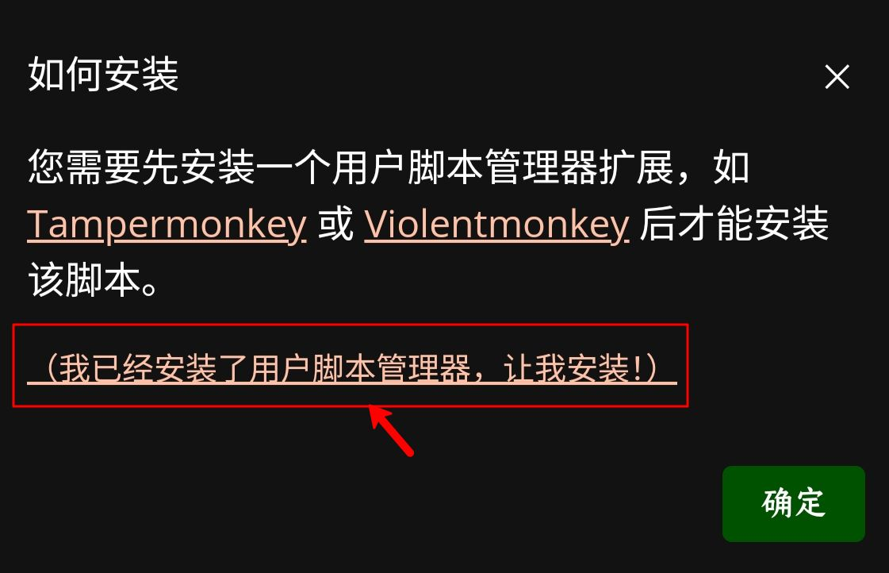
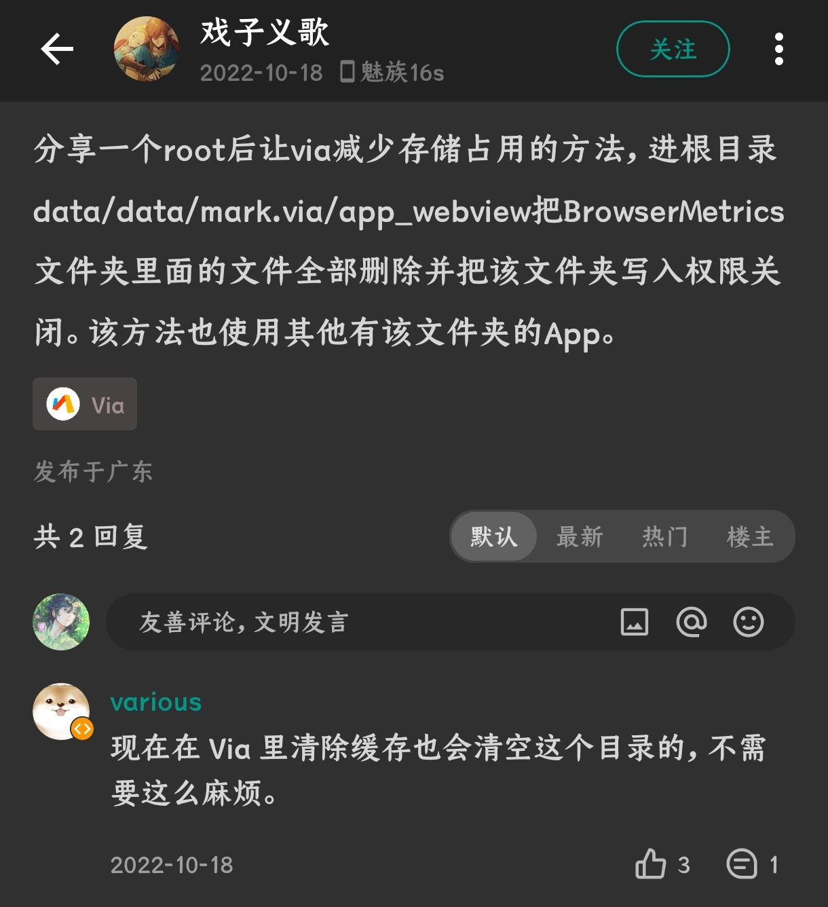
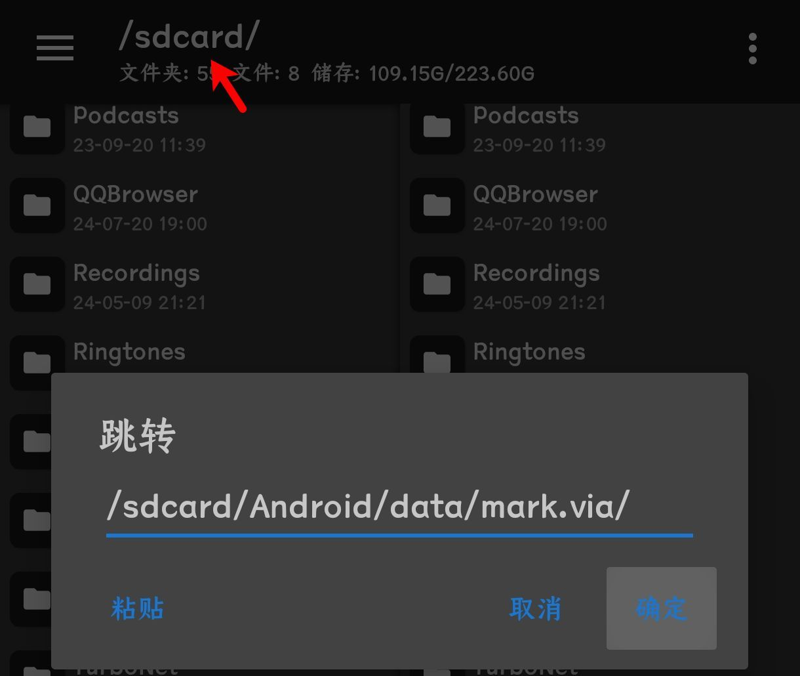
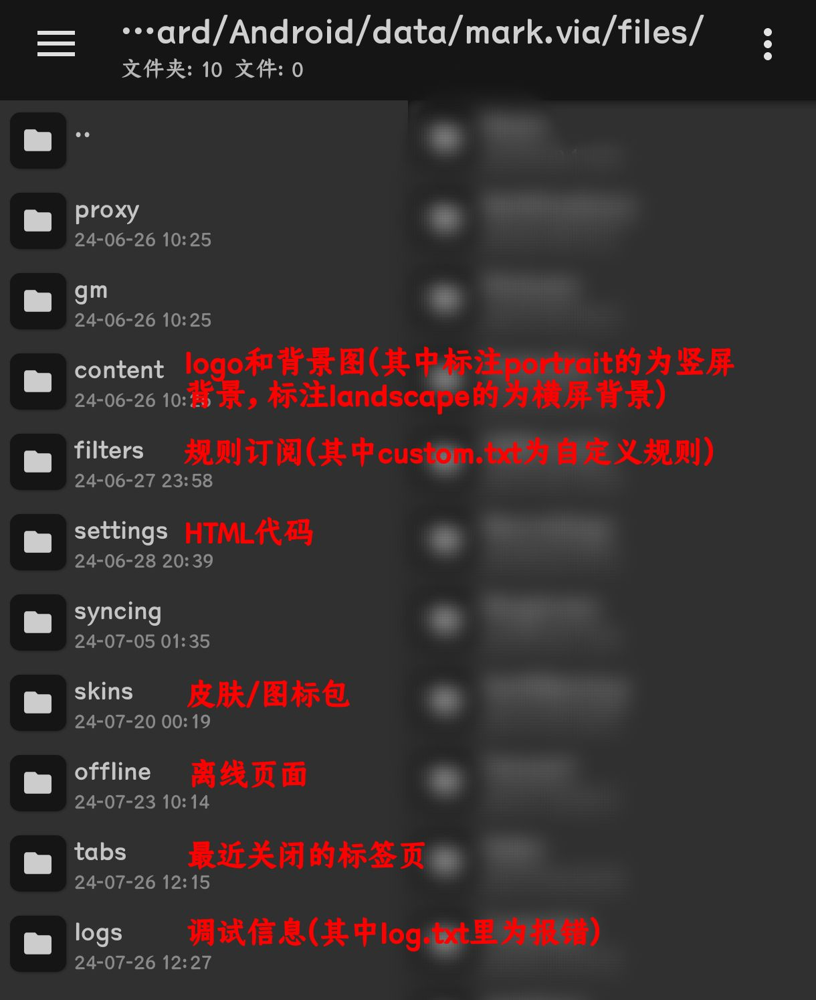

# 问答专区与使用技巧

## 💡问答专区

1.官方问答镇楼

> [Android版via常见问题文档](https://viayoo.com/zh-cn/docs/via-for-android-faq.html)

2.via浏览器触发异常问题？ && 屏幕底部弹出乱码怎么解决？

> 官方问答中也有相应解释，可将相应截图反馈到[[QQ频道 ](https://pd.qq.com/s/142yif2dj)| [TG群组 ](https://t.me/+bMMIgOk0cnA3YjI9)| [反馈社区](https://support.qq.com/embed/phone/438363)]   设置＞关于，点击via的logo滑到最底下查看最新的log报错   如果滑不到底可以在关于页面的右上角点击分享，用其他软件查看 _log.txt_

3.总是提示有不安全弹窗，能否关闭？

> 触发情况类似下图      设置＞高级＞忽略SSL证书警告，该功能主要是用于提醒站点证书是否有效   忽略后仍然可以在地址栏左侧图标中查看(如下图)   

4.如何查询系统webview版本号？怎么更新系统webview？

> ❶查询版本:①设置＞关于，点击via的logo，第十行的“WebView Version”后面就是版本号   ②设置＞关于，如果不是华为鸿蒙系统，长按via的logo就可以打开webview的开发者工具，如下图所示就是webview版本号      (⚠注意：华为鸿蒙系统的最新版的HUAWEI webview可类似Android webview的99版本)   ❷更新版本:最稳妥的方法就是到谷歌商店里，进入[系统webview](https://play.google.com/store/apps/details?id=com.google.android.webview)链接，点击菜单中“其他应用打开”或者长按菜单中“分享”，然后选择GooglePlay即可开始下载安装

5.网页版式出现错误？

> <small>长按菜单中的“网站设定”(如没有此按钮，就长按“设置”，把网站设定移入)，将JavaScript设为允许，查看网页是否正常</small>   1.如此前有允许JavaScript，则再尝试关闭脚本、关闭广告拦截、关闭电脑模式、字体大小设为100%、浏览器标识换为默认，查看网页是否正常，   2.如正常，再细化排查即可；如不正常，可再尝试关闭模块、更新webview(上面有提到)，如果仍然不能解决，可以按照“2.via浏览器触发异常问题？”提供的渠道去反馈，并说明上述流程已经尝试过

6.各种同步方式有什么差异？

> <small>前提：不考虑root和系统备份的方法，仅探讨via内支持的同步方式</small>   ①数据方面：导入/备份数据＞webdav同步＞via的云同步。除备份不了网页数据(正常现象)外，上述提及的三种方式均不能同步主页图片、图标包/皮肤、最近关闭的标签页、离线页面。特殊的，via的云同步不同步脚本和规则，同步的书签数量也限制300条;仅有导入/备份数据支持同步自定义规则   ②跨浏览器备份：webdav同步＞导入/备份数据=via的云同步。webdav同步支持自动同步且可以选择只同步书签和收藏，也支持与floccus扩展同步数据，详见[chrome与via同步书签](https://blog.qianxun.site/教程/pc端chrome使用floccus扩展和移动端via同步书签/)   ③跨设备备份：肿么？你via的iOS端是支持webdav？(不开玩笑了，还是希望iOS端早日更新)

7.夜间模式失效？网页没有变暗？

> ①可能是网页自身不支持夜间模式切换。可以长按菜单中的“夜间模式”，启用“强制网页暗色”   ②可能是网页使用图片或视频作为背景，这类网页背景不能暗色，可以尝试使用菜单中的“标记广告”(没有就长按菜单中“设置”，将标记广告移入)屏蔽背景   ③系统不支持强制暗色。可能是webview版本过低或者模块影响，自行排查

8.via刷新不出网页？无法使用？

> <small>请先确保自己网速正常，网络配置无误</small>   1.回忆自己此前是否在启用/关闭🅅🄿🄽的瞬间仍然让via处于后台或小窗状态，如是，退掉via当前的后台或小窗重新进入即可，出现原因参考如下      2.如不是或按照上述方法不能解决，尝试启用🅅🄿🄽后再进入via，如能解决说明是dns污染问题(类似GitHub软件能用，网站不能进)   3.如仍然无法进入，按照“5.网页版式出现错误？”的流程走一边(应该主要是webview版本或者模块)

9.via浏览器的隐私保护如何？

>     浏览器本身隐私保护没有问题，但对于有“无痕”状态需求的用户来说，via的隐身模式仅能保证本地不保留浏览的相关记录，网页中记录的历史、登录状态等仍然会保留

10.怎么装脚本？为什么脚本安装失败？

> 安装脚本：①[GreasyFork](https://greasyfork.org/scripts?filter_locale=0&set=586537)里直接找脚本，进入，点击“安装此脚本”，进入就可以解析安装。如遇下图提示，请点击框内部分，因为via浏览器自带脚本管理器，无需添加其他脚本管理器      ②如果遇到无法解析安装的脚本，可以前往设置＞脚本，右上角添加符号选择“下载脚本”，把脚本链接复制进去(只有纯文字网址才能解析哦，不懂的话别乱填)   ③如果是本地脚本文件需要导入，可以前往设置＞脚本，右上角添加符号选择“导入脚本”选择

> 失败原因：①点击安装后无任何反应，可能是via版本过低，前往[[酷安](https://www.coolapk.com/apk/mark.via)|[官网](https://viayoo.com)]更新，如更新后依旧，查看上述“安装脚本”的第二点   ②底部弹窗“解析中”然后后续没有提示安装，尝试更新webview，如果仍然这样大概率是网络问题，更换或者确保自己网络好后再试   ③底部弹窗“依赖失败”，说明脚本中有资源以你的网络无法访问，大概率是dns污染，可以尝试使用🅅🄿🄽解决   ④底部弹窗“安装脚本失败”，参考②③

*****

## 💡使用技巧

1.打开脚本设置/脚本菜单

> via浏览器更新5.0后便支持脚本设置，打开方式有两种：   ①点击地址栏左侧图标(默认图标是护盾)，然后点击“脚本”   ②长按菜单中的“设置”，然后将“脚本”移入菜单，后续便可在菜单中直接使用  
(虽然[脚本介绍](script-share.md)里提及过，但好像大多数人还是不知道……，这也算是此技巧区会出现的原因之一)

2.批量下载图片

> via目前没有这个功能，可以使用脚本[Picviewer CE+](https://greasyfork.org/zh-CN/scripts/24204)(悬停在图片上，图片左上角会出现脚本的半透明悬浮窗，进入即可选择图片批量下载)或[通用图片下载器](https://greasyfork.org/zh-CN/scripts/501400)(界面左下角按钮用于保存此页面所有图片)

3.嗅探视频下载

> via虽然自带这个功能，但总体体验不太适合懒人，也没有合适的教程，这边推荐用脚本[仿via资源嗅探](https://greasyfork.org/zh-CN/scripts/471390)   使用方法：打开有视频资源的网页，并播放视频；打开脚本菜单，找到此脚本，点击“资源嗅探①”，后续一般就没问题了直接下。目前试的大部分mp4都可以直接下载   m3u8格式的视频就用via自动展示的嗅探按钮，选择第三方下载器来解决吧，毕竟via没有m3u8转mp4功能

4.清理浏览器存储占用过大的via(其他浏览器可能同理)

> 正常情况下via的存储占用不会超过1G，查看webview版本是否在105上下(具体区间不明)，如果是那就有可能是webview的bug，更新webview然后清除缓存(设置＞通用＞清除数据，单选“缓存”，点击确定)即可      如果不是，可在清除数据中选择缓存、历史、最近关闭的标签页、应用缓存，确定后一般就恢复正常了。相应的，在“退出时清除数据”设置中你也可以选择相关数据自动清理一下，不会影响设置规则脚本网站数据那些

*****

## 💡玩机技巧

⚠说明：此技巧不提供解bl和获取root权限教程，太麻烦也有点超出本收藏涵盖内容

> 提前罗列可能需要用到的东西，如果GitHub不会进就用另一个

MT管理器[[官网](https://mt2.cn/download/)]、Shizuku[[GitHub](https://github.com/RikkaApps/Shizuku/releases)|[安卓网](http://m.2265.com/down/308553.html)]、InstallerX[[GitHub](https://github.com/iamr0s/InstallerX/releases)|[安卓网](http://m.2265.com/down/504743.html)]、HyperCeiler[[官网](https://cemiuiler.sevtinge.cc/Download.html)]

1.Shizuku授权教程

> ⚠华为鸿蒙系统阉割掉了开发者选项中的无线调试功能，只能连接电脑借助adb授权，可参考[adb权限激活(B站视频教程)](https://www.bilibili.com/video/BV1cfVxeiE8T)，工具在视频简介   无线调试方案可参考[Shizuku授权软件教程](https://mp.weixin.qq.com/s?src=11&timestamp=1721383180&ver=5392&signature=l41Zfb3URRrQ0ynCHjY*7z38IKiaMNlip2J-diMQgD4NYnbFGMpoURAlOemC70VZ-EHy4sIl3K9Iq3am757w1B0MfXeCCseBCsQ-UE15hRyq5n-Bi0xGkGIiifqtO-4H)。原先via内测支持莫奈色的时候就想搞此部分了，结果砍了……还是先留着，毕竟换安装器也用得到不是吗？

2.规避HyperOS自带安装器的禁止安装(含如何更换系统安装器)

> 触发情况类似下图      解决方案：   ①无额外授权、无root权限：下载[国际版via](https://viayoo.com/en/)，小米暂未屏蔽此版本的via。缺点是后续可能被补上   ②无root权限：用Shizuku授权第三方安装器(个人使用的是InstallerX)，在软件设置中锁定为默认安装器，替换掉系统自带安装器，来为第三方安装器提供权限   ③有root权限：HyperOS系统的手机使用HyperCeiler模块，找到“应用包管理组件”，将相应限制禁用。另提一嘴，HyperOS遇到的限制问题一般都可以通过这个解决

3.访问via浏览器本地文件夹

> ①国内版：/sdcard/Android/data/mark.via/   ②国际版：/sdcard/Android/data/mark.via.gp/   (差异自行去看官方问答) 将上述对应来源的本地文件地址复制，粘贴到MT管理器地址栏上，如果提示无法访问文件夹，使用Shizuku为MT管理器授权即可      本地可查看的文件   

*****

## 💡其他

1.套壳浏览器在默认情况下不支持许多Chrome/Chromium原生特性，以下举例重要但via没有实现的部分:

> <small>CRX | 浏览器插件/扩展系统</small> (无法解决，技术不支持)   <small>Devtools | 开发者工具</small> (使用脚本[网页调试](https://greasyfork.org/scripts/475228))   <small>ChromeCast | Google投屏协议</small> (听说有计划搞投屏，但可能与这个不同)   <small>PIP | 原生画中画</small> (不考虑，因为via不做视频播放器)   <small>PasswordSave | 保存网站密码</small> (不考虑，有此需求详见最顶上的官方问答)

*****

## 💡有关via的其他推荐

1. [via浏览器可用脚本推荐](script-share.md)

2. [广告拦截规则+浏览器标识+搜索引擎等](messy-cont.md)

3. [via小功能或冷门知识](via-help.md)

4. [via浏览器各版本的拾穗整理](https://www.sgfox.cc/archives/via-shisui.html)

5. [via历史版本(官方版，豌豆荚链接)](https://m.wandoujia.com/apps/6609177/history)

6. [(via官方教程)使用webdav同步数据](https://viayoo.com/zh-cn/docs/sync-your-data-via-webdav.html)

*****

[返回主页](../README.md)