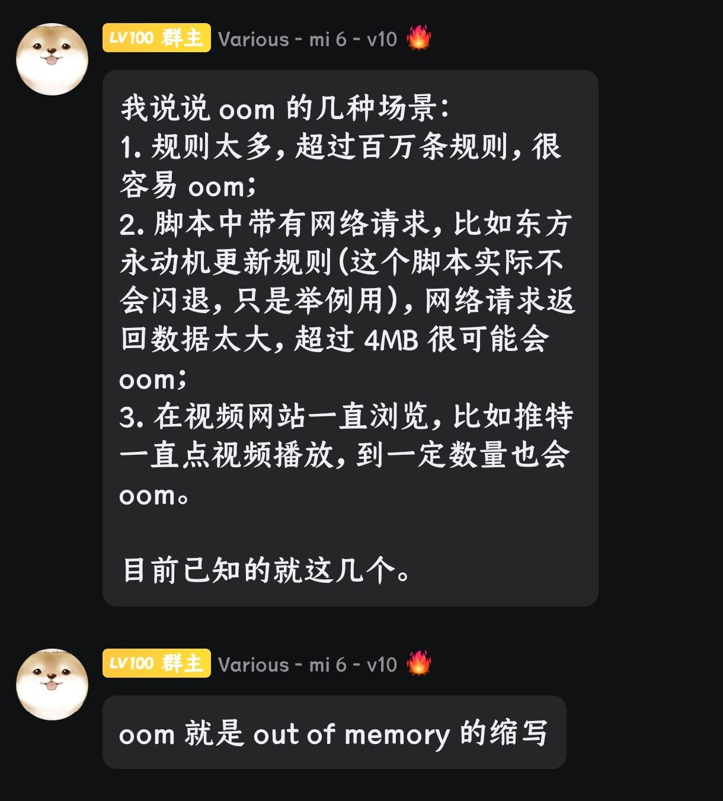

# 广告拦截

*****

本页目录:[☁️规则订阅](#%e8%a7%84%e5%88%99%e8%ae%a2%e9%98%85) | [✏️自定义规则](#%EF%B8%8F%E8%87%AA%E5%AE%9A%E4%B9%89%E8%A7%84%E5%88%99) | [❗️注意点](#%EF%B8%8F%E6%B3%A8%E6%84%8F%E7%82%B9)

## ☁️规则订阅

> 使用方法：将网址单独复制，然后进入via的设置＞通用＞广告拦截＞规则订阅，点击右上角添加符号(默认为“+”)，选择“自定义”，将下列网址粘贴进去

✧给出规则多为镜像，可能不稳定，如有条件可通过GitHub主页订阅

主要推荐“[轻量广告拦截规则](https://slink.ltd/https://raw.githubusercontent.com/damengzhu/banad/main/jiekouAD.txt)”、"[GOODBYEADS](https://slink.ltd/raw.githubusercontent.com/8680/GOODBYEADS/master/data/rules/allow.txt)"、“[混合规则精简版](https://slink.ltd/https://raw.githubusercontent.com/lingeringsound/adblock_auto/main/Rules/adblock_auto_lite.txt)”，不误杀就是最好的效果

 ✧展开小型规则列表✧ 

> Ad Filter J([GitHub主页](https://github.com/jk278/Ad-J)，400+规则)   https://slink.ltd/https://raw.githubusercontent.com/jk278/Ad-J/main/Ad-J.txt

> 去除APP下载提醒([GitHub主页](https://github.com/Noyllopa/NoAppDownload)，1000+规则)   https://fastly.jsdelivr.net/gh/Noyllopa/NoAppDownload@master/NoAppDownload.txt

> Adblock Warning Removal List(2000+规则，via预留，用于移除网站屏蔽拦截)   https://easylist-downloads.adblockplus.org/antiadblockfilters.txt

> 轻量广告拦截规则([GitHub主页](https://github.com/damengzhu/banad)，酷安@大萌主，5000+规则)   https://slink.ltd/https://raw.githubusercontent.com/damengzhu/banad/main/jiekouAD.txt

> AdGuard Mobile(7000+规则，专治手机端的广告)   https://filters.adtidy.org/extension/ublock/filters/11.txt)

> 去广告Adblock规则(酷安@夕阳醉歌，7000+规则)   https://slink.ltd/https://raw.githubusercontent.com/lingeringsound/adblock_auto/main/base/%E5%85%B6%E4%BB%96.prop

> adgk手机去广告规则([GitHub主页](https://github.com/banbendalao/ADgk)，9000+规则，需开科学，⚠已较长时间未维护)   https://slink.ltd/https://raw.githubusercontent.com/banbendalao/ADgk/master/ADgk.txt

> GOODBYEADS([GitHub主页](https://github.com/8680/GOODBYEADS)，1w+规则，包含“去除APP下载提醒”)   https://slink.ltd/https://raw.githubusercontent.com/8680/GOODBYEADS/master/data/rules/allow.txt

> 屏蔽获取Cookie弹窗(2w+规则)   https://slink.ltd/https://raw.githubusercontent.com/AdguardTeam/FiltersRegistry/master/filters/filter_18_Annoyances_Cookies/filter.txt

 ✧展开大型规则列表✧ 

> 混合规则精简版([发布页](https://lingeringsound.github.io/adblock_auto/)，酷安@夕阳醉歌，3w+规则，包含“AdGuard Mobile”、“去广告Adblock规则”)   https://slink.ltd/https://raw.githubusercontent.com/lingeringsound/adblock_auto/main/Rules/adblock_auto_lite.txt

> AdKiller-Lite([GitHub主页](https://github.com/PhoenixLjw/AdRules)，3w+规则，包含“轻量广告拦截规则”和“去除APP下载提醒”)   https://slink.ltd/https://raw.githubusercontent.com/PhoenixLjw/AdRules/main/filter-lite.txt

> AdRules AdBlock List Lite([GitHub主页](https://github.com/Cats-Team/AdRules)，3w+规则)   https://adrules.top/adblock_lite.txt

> ABP Merge Rules([GitHub主页](https://github.com/damengzhu/abpmerge)，5w+规则，包含“轻量广告拦截规则”)   https://slink.ltd/https://raw.githubusercontent.com/damengzhu/abpmerge/main/abpmerge.txt

> AdBlock Filter([GitHub主页](https://github.com/217heidai/adblockfilters)，10w+规则，包含“轻量广告拦截规则”)   https://slink.ltd/https://raw.githubusercontent.com/217heidai/adblockfilters/main/rules/adblockfilters.txt

## ✏️自定义规则

> 使用方法：  
> ①手动编辑：进入via的设置＞通用＞广告拦截＞自定义规则  
> ②标记广告：进入网站，点击菜单中“标记广告”，点击网页内需要拦截的广告  
> ③网络日志：进入网站，点击菜单中“网络日志”，长按需要拦截的链接选择“拦截域名”或“拦截链接”

简单解析下规则

> @@||pagead2.googlesyndication.com^$domain=bilinovel.com

> `@@`前缀代表例外放行，让其他规则不去拦截  
> `||`代表匹配任意协议(HTTP/HTTPS)及子域名  
> `^`代表分隔符，类似网址中的`/`或其他参数  
> `$domain=`代表仅此域名触发此条规则  
> 合起来的意思就是“仅在用户访问bilinovel.com域名时允许加载来自pagead2.googlesyndication.com的所有资源”

其他可参考→[广告拦截能力说明](https://www.coolapk.com/feed/59124429?shareKey=MmZjNGE0OGFhODI0NjdkZTUxN2I~)

## ❗️注意点

> via几乎支持所有AdblockPlus的规则，但不支持Adguard额外搞的拓展规则，挑选规则主要还是以前者为主

> “网络日志”中灰色的链接即为被规则拦截的链接，长按后会有个“放行规则”(如没有就是via内建规则拦截掉的)，点击后就会在自定义规则里添加放行或移除拦截

> Android版Via的4.5.0版本及以后支持广告规则去重，但重复的规则仍然会拖慢网页加载速度，请适量   

> via浏览器的“启用内建规则”建议开启，如遇误杀可自行尝试放行并将问题反馈给官方       

> 想查询内建规则，可提取安装包后查看，找到 assets/simple.txt 里面即是via的内建规则

*****

[返回推荐](../messy-cont.md) | [返回数据](data.md) | [返回主页](../../README.md)