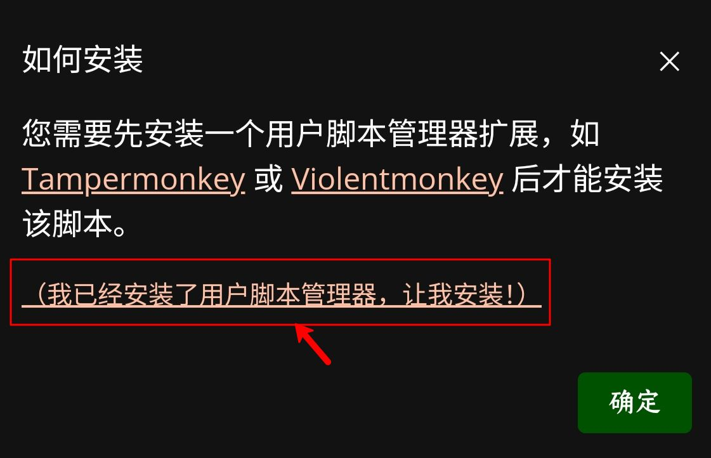

# 脚本

本页目录：[⏳脚本简述](#%E8%84%9A%E6%9C%AC%E7%AE%80%E8%BF%B0)|[🔩安装脚本](#%E5%AE%89%E8%A3%85%E8%84%9A%E6%9C%AC)|[🔧脚本安装失败](#%E8%84%9A%E6%9C%AC%E5%AE%89%E8%A3%85%E5%A4%B1%E8%B4%A5)|[📃脚本菜单](#%E8%84%9A%E6%9C%AC%E8%8F%9C%E5%8D%95)|[📋脚本编辑设置](#%E8%84%9A%E6%9C%AC%E7%BC%96%E8%BE%91%E8%AE%BE%E7%BD%AE)|[🛠脚本注意事项](#%E8%84%9A%E6%9C%AC%E6%B3%A8%E6%84%8F%E4%BA%8B%E9%A1%B9)

## ⏳脚本简述

> 浏览器大环境：在纯JavaScript逐渐难以满足需求的情况下，Firefox推出油猴(GreasyMonkey)插件，让用户脚本有一个开发友好型环境，但随着其他类似浏览器插件/拓展的发展，仅能用于Firefox且[便利性相对较低](https://www.zhihu.com/question/276041379/answer/1485274680)的油猴逐渐没落，“油猴”一词成了宽泛的统称  
> 现状：[油猴脚本](GMAPI.md)是使用了油猴元数据的用户脚本

> Via：Android版的via在4.4.2版本及以后开始支持油猴API，纯JS代表的“Via轻插件”(第三方，即用户[@谷花泰](http://www.coolapk.com/u/486230)维护，现已闭站)内的用户脚本逐渐就开始淘汰了，在多个版本又对油猴环境进行了补全，现已支持大部分的油猴脚本(但不支持浏览器插件/拓展)，所以出现以下询问时，请点击框内部分  

## 🔩安装脚本

> ①直接安装：用via进入以`.user.js`为结尾的网址，如[去除链接重定向](https://update.greasyfork.org/scripts/483475.user.js)，进入后网页是纯文字，网页加载完毕后会弹窗提示，点确定后静待安装完毕

 个人整理的脚本列表 

收藏夹(被墙)：[主体推荐](https://greasyfork.org/scripts?filter_locale=0&set=586537) | [PC补充篇](https://greasyfork.org/scripts?filter_locale=0&set=590548) | [不可说の篇](https://sleazyfork.org/scripts?filter_locale=0&set=590678)    
[⭐️完整脚本列表⭐️](../script-share.md) 
  

 常见的油猴脚本分享平台 
 
[油叉GreasyFork](https://greasyfork.org/scripts?filter_locale=0&sort=updated)(最大的开源脚本共享平台，现已被墙)  
[脚本猫ScriptCat](https://scriptcat.org/search?script_type=1&sort=updatetime)(主要是国内脚本)  
[GitHub中搜索脚本](https://github.com/search?q===UserScript==%20%20@name%20@description&type=code)(主要是国外脚本，应该需要翻)  
[开源用户脚本Openuserjs](https://openuserjs.org)(不支持中文)  
[用户脚本聚合搜索Userscript](https://www.userscript.zone)(比较旧) 

> ②链接引入：进入via的设置＞脚本，点击右上角添加符号(默认为“+”)，点击“下载脚本”，将符合格式的网址粘贴进去，如https://update.greasyfork.org/scripts/483475.user.js ，识别成功后会弹窗提示，点确定后静待安装完毕

> ③本地导入：进入via的设置＞脚本，点击右上角添加符号(默认为“+”)，点击“导入脚本”，选择纯文本或js格式文件(注：如js文件无法选择，可改后缀为.txt)，如[谷歌下载修复](https://www.lanzn.com/tp/i7qKP2qab3yh)，下载下来的文件格式为`.txt`，选择导入后识别成功会弹窗提示，点确定后静待安装完毕

## 🔧脚本安装失败

> ①进入链接后无任何提示：  
> ❶可能是via版本过低，前往[[酷安](https://www.coolapk.com/apk/mark.via)|[官网](https://viayoo.com)]更新  
> ❷如via已是最新版，尝试使用“安装脚本”的链接引入

> ②底部弹窗“解析中”然后后续没有提示安装  
> ❶尝试更新webview，如果仍然这样大概率是网络问题，更换或者确保自己网络好后再试  
> ❷如是在设置＞脚本中更新脚本，在离开此页面后不会提示，更新时尽量保持在此页面不变

> ③底部弹窗“依赖失败”，说明脚本中有以你网络无法访问的依赖资源(即脚本链接里的`@require`和`@resource`)，大概率是dns污染，可以尝试使用🅅🄿🄽解决

> ④底部弹窗“安装脚本失败”，参考②③

## 📃脚本菜单

> Android版的via在4.5.0版本及以后，支持脚本菜单选项，样式为窗口菜单，可用下方两种方式打开：  
> ①进入网页，点击地址栏左侧图标(默认图标是护盾)，然后点击“脚本” 
> ②长按菜单中的“设置”，然后将“脚本”移入菜单，移入后打开网页便可在菜单中直接使用

脚本菜单中仅显示匹配此域名的脚本并依照执行时机排序，点击对应脚本可以进入二级菜单(此处也算是狭义的脚本菜单，为避免混淆，交流间尽量使用“xx脚本的菜单”表述)，默认有`启用/禁用`、`编辑`、`排除`、`在设置中查看`选项，如果脚本自身也添加了选项，则脚本完全加载完毕后会在上述选项之后依照字母顺序排序添加选项(如果已知脚本有脚本菜单，可以依此判断脚本是否正常加载)

## 📋脚本编辑设置

> Android版的via在5.7.0版本及以后，支持脚本编辑选项，样式为整页设置(所以也称脚本设置)。进入via的设置＞脚本，点击对应脚本进入，可以查看脚本信息、更改运行时机、添加匹配/排除、查看依赖/资源等

在脚本二级菜单中对脚本进行排除后，是无法在菜单中进行匹配的，此时就只能在对应脚本编辑中更改

如偶然发现脚本失效，可以先在脚本编辑设置中查看依赖/资源，显示为灰色即代表缺失，点击后可尝试下载

## 🛠脚本注意事项

Via内置的油猴环境

> 对于无法安装插件的Via来说，自带油猴环境无疑更好发展此功能，但  
无法支持iframe注入,相对应的功能会缺失(跨域JS无法处理)  
无法完全绕过CSP策略(处理了简易的,还剩绕不过的和为了安全不绕过的)

针对特大脚本的说明

> Android版的via在5.7.0版本及以后，可存储的脚本上限被提高至4MB，在此之前，上限为2MB(已知沉浸式翻译超过这个限制)  
特大脚本会导致自身及在其之后的所有脚本失效，介于via暂不支持脚本排序，建议大脚本尽量最后装

脚本详细知识

> 参考[油猴脚本API参考](GMAPI.md)

*****

[返回数据](data.md) | [返回脚本列表](../script-share.md) | [返回主页](../../README.md)