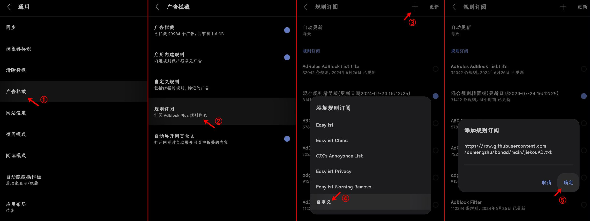
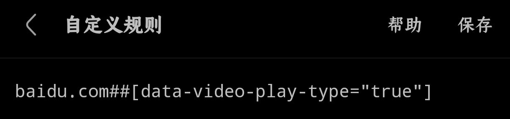
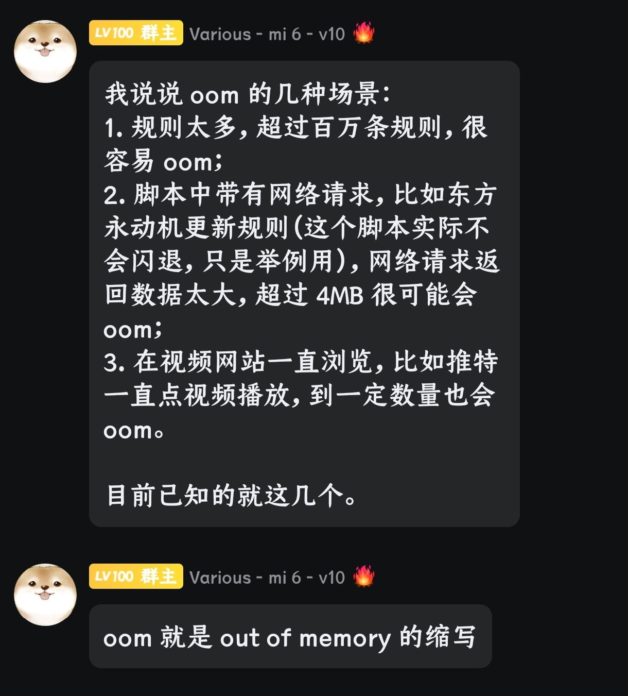
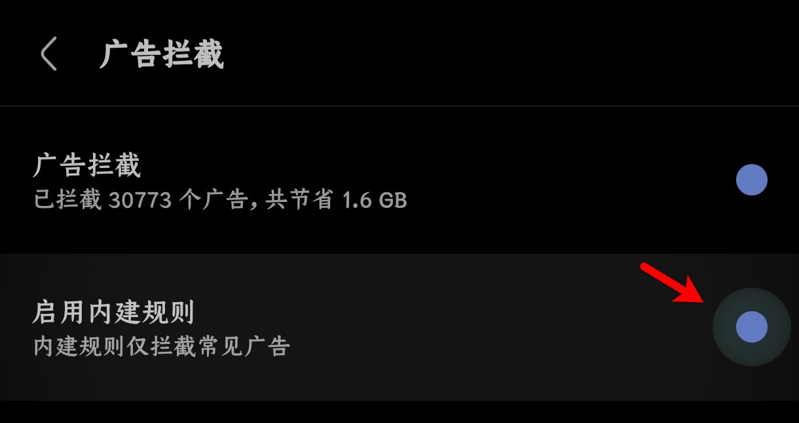
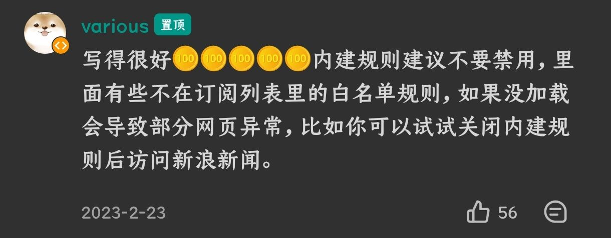
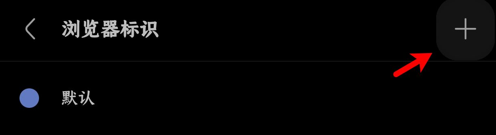
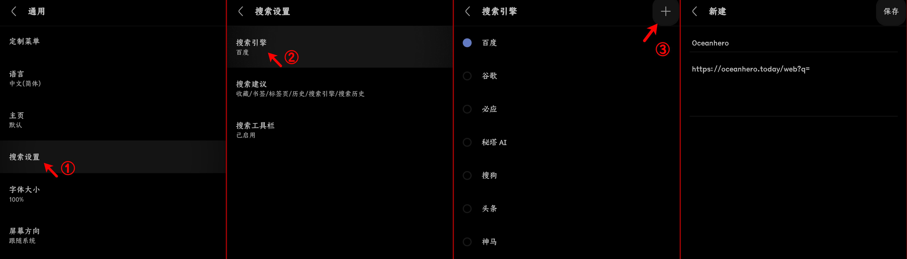

# 奇奇怪怪的推荐

## 🚫广告拦截规则(Adblock)

使用方法：将网址单独复制，然后进入via的设置＞通用＞广告拦截＞规则订阅，点击右上角添加符号(默认为“+”)，选择“自定义”，将下列网址粘贴进去



✧部分规则无法更新新请先尝试 开科学/魔法，无果后再尝试反馈作者

主要推荐“[轻量广告拦截规则](https://raw.gitmirror.com/damengzhu/banad/main/jiekouAD.txt)”、"[白名单规则](https://mirror.ghproxy.com/raw.githubusercontent.com/8680/GOODBYEADS/master/allow.txt)"、“[混合规则精简版](https://lingeringsound.github.io/adblock_auto/Rules/adblock_auto_lite.txt)”和“[Ad-J](https://gcore.jsdelivr.net/gh/jk278/Ad-J/Ad-J.txt)”，不误杀就是最好的效果

<details><summary> ✧展开小型规则列表✧ </summary>

> Ad-J(300+规则) <br> https://gcore.jsdelivr.net/gh/jk278/Ad-J/Ad-J.txt

> 去除APP下载提醒(1000+规则) <br> https://cdn.jsdelivr.net/gh/Noyllopa/NoAppDownload@master/NoAppDownload.txt

> 白名单规则(4000+规则，唯一一个全部为避免误杀的订阅) <br> https://ghp.ci/raw.githubusercontent.com/8680/GOODBYEADS/master/data/rules/allow.txt

> 轻量广告拦截规则(酷安@大萌主，5000+规则) <br> https://github.moeyy.xyz/https://raw.githubusercontent.com/damengzhu/banad/main/jiekouAD.txt

> AdGuard Mobile Ads filter(7000+规则) <br> https://filters.adtidy.org/extension/ublock/filters/11.txt)

> adgk手机去广告规则(9000+规则，需开科学) <br> https://raw.githubusercontent.com/banbendalao/ADgk/master/ADgk.txt

> 屏蔽获取Cookie弹窗(近2w规则，可能需开科学) <br> https://raw.githubusercontent.com/AdguardTeam/FiltersRegistry/master/filters/filter_18_Annoyances_Cookies/filter.txt

> 混合规则精简版(酷安@夕阳醉歌，2w+规则) <br> https://lingeringsound.github.io/adblock_auto/Rules/adblock_auto_lite.txt

</details>

<details><summary> ✧展开大型规则列表✧ </summary>

> AdKiller-Lite(3w+规则，包含“轻量广告拦截规则”和“去除APP下载提醒”) <br> https://raw.gitmirror.com/PhoenixLjw/AdRules/main/filter-lite.txt

> AdRules AdBlock List Lite(3w+规则，需开科学) <br> https://adrules.top/adblock_lite.txt

> ABP Merge Rules(5w+规则，包含“轻量广告拦截规则”) <br> https://raw.gitmirror.com/damengzhu/abpmerge/main/abpmerge.txt

> AdFilters(6w+规则) <br> https://cdn.jsdelivr.net/gh/o0HalfLife0o/list/ad3.txt

> AdBlock Filter(11w+规则，包含“adgk手机去广告规则”，需开科学) <br> https://raw.githubusercontent.com/217heidai/adblockfilters/main/rules/adblockfilters.txt

</details>

<details><summary> ✧自定义规则简易使用方法✧ </summary>

例如：隐藏百度首页自动播放的视频(因为不是广告，大多规则订阅并不会将其加入)

```
baidu.com##[data-video-play-type="true"]
```

进入via的设置＞通用＞广告拦截＞自定义规则，将规则粘贴进去即可



</details>

> 直接添加自定义规则一般很少用到，因为菜单中的“标记广告”功能(长按菜单中“设置”就能将“标记广告”添加入菜单)可以直接在页面上选中。如遇无法标记的广告可以寻求帮助

<br>

⚠注意

> 尽管via浏览器目前已经支持广告规则去重(4.5.0)，但重复的规则仍然会拖慢网页加载速度，请适量 <br> <details><summary> 了解详细 </summary></details>

> via浏览器的“启用内建规则”建议开启，如遇误杀直接将问题反馈给官方即可 <br> <details><summary> 了解详细 </summary>  <br> </details>

*****

## 📲浏览器标识(User Agent)

浏览器标识(简称UA)可以使服务器能够识别客户使用的操作系统及版本、浏览器内核及版本、浏览器渲染引擎、浏览器语言等,让网页作出相应的适应(如识别电脑手机端、添加推送等)

⚠提醒：因部分网站的特殊性，应尽量避免使用除默认以外的全局UA，不然可能出现Google安全认证未通过、Cloudflare人机验证频繁失败等问题

使用方法：设置＞通用＞浏览器标识，点击右上角的添加符号(默认为“+”)，将需添加到UA粘贴进“浏览器标识”框内即可



<details><summary> ✧展开推荐UA列表✧ </summary>

1. 简单搜索UA旧版整合

> 优点：百度关自动播放(不缓存)、防拉💩、必应无下载提示 <br> 缺点：没有搜索框、内核可能有点旧

> Mozilla/5.0 (Linux; U; Android 10; zh-CN; 2014811 Build/QQ3A.200805.001) AppleWebKit/537.36 (KHTML, like Gecko) Version/4.0 Chrome/119.0.2564.116 Quark/3.8.2.126 Mobile Safari/537.36 T7/10.3 SearchCraft/2.6.3 (Baidu; P1 8.0.0) edge

2. 简单搜索UA新版 

> 优点：百度有AI、关自动播放、会自动翻页、防拉💩 <br> 缺点：没有搜索框、UI变动大、没有横栏切换、视频仍然会缓存

> Mozilla/5.0 (Linux; Android 12; PDKM00 Build/SP1A.210812.016; wv) AppleWebKit/537.36 (KHTML, like Gecko) Version/4.0 Chrome/97.0.4692.98 Mobile Safari/537.36 T7/13.50 ChatSearch/1.0 SearchCraft/5.10.0.13 (Baidu; P1 12)

3. Edge移动端浏览器默认UA 

> 优点：百度关自动播放(不缓存)、有搜索框；必应去除下载提醒 <br> 缺点：不防百度拉💩

> Mozilla/5.0 (Linux; Android 15; K) AppleWebKit/537.36 (KHTML, like Gecko) Chrome/126.0.0.0 Mobile Safari/537.36 EdgA/126.0.0.0

4. 火狐/雨见浏览器默认UA `类似Edge的UA`

> Mozilla/5.0 (Android 14; Mobile; rv:120.0) Gecko/120.0 Firefox/120.0

5. 小米浏览器默认UA 

> 最好是给百度系的单独设置，其他网页可能会加广告

> Mozilla/5.0 (Linux; U; Android 13; zh-cn; 23013RK75C Build/TKQ1.220905.001) AppleWebKit/537.36 (KHTML, like Gecko) Version/4.0 Chrome/100.0.4896.127 Mobile Safari/537.36 XiaoMi/MiuiBrowser/17.3.5 swan-mibrowser

6. 微信8.0.49版本的UA

> 最好是只给提醒“请用微信APP打开”的网站使用

> Mozilla/5.0 (Linux; Android 14; 22081212C Build/UKQ1.230917.001; wv) AppleWebKit/537.36 (KHTML, like Gecko) Version/4.0 Chrome/116.0.0.0 Mobile Safari/537.36 XWEB/1160175 MMWEBSDK/20240404 MMWEBID/7962 MicroMessenger/8.0.49.2600(0x2800313D) WeChat/arm64 Weixin NetType/WIFI Language/zh_CN ABI/arm64

7. 夸克UA

> 最好是给神马/夸克系单独设置去除app提示

> Mozilla/5.0 (Linux; U; Android 14; zh-CN; 22081212C Build/UKQ1.230917.001) AppleWebKit/537.36 (KHTML, like Gecko) Version/4.0 Chrome/100.0.4896.58 Quark/7.2.6.641 Mobile Safari/537.36

</details>

这边不打算更新更多了，提供一个检测UA的网站，也附带了一些常见浏览器的UA

[UA检测-在线工具](https://useragent.buyaocha.com)

*****

## 🔍搜索引擎(Search Engines)

via5.5.0后支持自定义多个搜索引擎，在5.8.0后将搜索建议、搜索引擎并在搜索设置内

使用方法：设置＞通用＞搜索设置＞搜索引擎，点击右上角的添加符号(默认为“+”)



<details><summary>常规搜索引擎列表(暂收录15个)</summary>

> bing中国 <br> https://cn.bing.com/search?q= <br> via自带的为国际版，国内使用国际版会有一次重定向，或许可以规避一些加载慢的问题

> Oceanhero(德国的搜索引擎，称每五次搜索就收集一个海洋塑料瓶) <br> https://oceanhero.today/web?q= <br> 基于DuckDuckGo，无广告，完美的自动翻页，会保留到上次阅读词条，自带一个能识别中文但不会中文回答的AI

> Whoogle(开源搜索引擎) <br> https://search.snine.nl/search?q= <br> 基于Google，无广告，[开源地址](https://github.com/benbusby/whoogle-search)

> 勾勾搜索(开源搜索引擎) <br> https://gogo.webbillion.cn/search?q= <br>基于Google，无广告，[开源地址](https://github.com/zenuo/gogo)

> SearXNG(开源搜索引擎) <br> https://searx.si/search?q= <br> 聚合搜索引擎，无广告，不收集或跟踪用户数据；国内能使用的站点不一定稳定

> Cynay(称是世界上第一个独立个体制作的搜索引擎) <br> https://cynay.com/search?q= <br> 基于Bing，无广告，有点慢的自动翻页

> Qwant(法国搜索引擎) <br> https://www.qwant.com/?q= <br> 基于Bing，无广告，不收集或跟踪用户数据

> eFind(美国搜索引擎) <br> https://efind.com/search?q= <br> 目前无广告，时好时坏的自动翻页

> youcare(法国搜索引擎) <br> https://youcare.world/all?q= <br> 基于DuckDuckGo，目前无广告，会保留到上次阅读页码

> Yandex(俄国搜索引擎) <br> https://www.yandex.com/search/touch/?text= <br> 有广告，但架不住美图多

> Swisscows(瑞士搜索引擎，称是“家庭友好型”，不包含色情和暴力) <br> https://swisscows.com/en/web?query= <br> 不收集或跟踪用户数据

> Ecosia(德国搜索引擎，称是最环保的搜索引擎，采用太阳能发电) <br> https://www.ecosia.org/search?q= <br> 基于Bing，且国内网络使用会被劫持到Bing

> Yahoo(日本搜索引擎，要挂梯) <br> https://search.yahoo.com/search?p=

> Brave(美国搜索引擎，要挂梯) <br> https://search.brave.com/search?q=

> StartPage(荷兰搜索引擎，称是世界上最私密的搜索引擎，要挂梯) <br> https://www.startpage.com/sp/search?q=

> Yep(新加坡搜索引擎，要挂梯) <br> https://yep.com/web?q=

</details>

<details><summary>AI搜索引擎列表(暂收录14个)</summary>

> 秘塔AI(via在5.7.5版本后内置，可显示大纲视图) <br> https://metaso.cn/?q=

> KFindAI([GitHub开源](https://github.com/KMind-Inc/k-Find)，保留关键词) <br> https://kfind.kmind.com/search?q=

> 360AI(无需登录，保留关键词) <br> https://www.sou.com/?q=

> 大同AI(无需登录，保留关键词，自带翻译功能) <br> https://datong.info/ui/search.html?q=

> iSouAI([GitHub开源](https://github.com/yokingma/search_with_ai)，保留关键词) <br> https://isou.chat/search?q=

> iAskAI(无需登录，保留关键词，不能中文回答) <br> https://iask.ai/?q=

> PhindAI(无需登录，保留关键词，不能中文回答) <br> https://phind-ai.com/zh/search?q=

> 开搜AI(手机验证码登录，不保留关键词，可显示大纲图表) <br> https://kaisouai.com?q=

> 天工AI(手机验证码登录，不保留关键词) <br> https://www.tiangong.cn/result?q=

> MikuAI(微信二维码登录，不保留关键词) <br> https://www.hellomiku.com/search?q=

> AndiAI(无需登录，对话式，不保留关键词) <br> https://andisearch.com/?q=

> Genspark(无需登录，要挂梯，保留关键词) <br> https://www.genspark.ai/search?query=

> PerplexityAI(无需登录，要挂梯，不保留关键词，不能用中文回答) <br> https://www.perplexity.ai/?q=

> ThinkAnyAI(要登录，登录可能需要挂梯，不保留关键词，能中文回答) <br> https://thinkany.so/zh/search?source=all&q=

</details>

<details><summary>其他搜索引擎列表</summary>

> 百度百科 <br> https://baike.baidu.com/item/%s/

> 哔哩哔哩 <br> https://www.bilibili.com/search?keyword=

> 微博 <br> https://weibo.com/search?containerid=100103type=1&q=

> 小红书 <br> https://wap.sogou.com/web/xiaohongshu?keyword=

> 微信文章 <br> https://weixin.sogou.com/weixinwap?type=2&query=

> 知乎搜索(登录后才能使用，知乎网页限制) <br> https://www.zhihu.com/search?type=content&q=

> 抖音 <br> https://www.douyin.com/search/

> Gitee <br> https://so.gitee.com/?q=

> GitHub <br> https://github.com/search?q=

> Quora(俗称“美版知乎”，登录后才能使用，要挂梯) <br> https://www.quora.com/search?q=

> 维基百科中文(Wiki，要挂梯) <br> https://zh.wikipedia.org/w/index.php?search=

</details>

💧夸克搜索引擎其实就是神马搜索(via自带)的换皮并加广告(夸克内没广告是因为其UA可以去自己的广告)，没有必要添加进去

⚠注意：部分搜索引擎有电脑和手机网页的区分，站点可能会自行重定向导致进度条多加载一次，此为正常现象，如果觉得缓慢可以将对应部分换为移动网页样式

*****

## 📖藏书阁(Bookmark Library)

信息时代有无数新兴网站诞生也有无数新兴网站消亡，或许互联网真的不存在记忆，但对于普通用户的我们，仍然需要找寻相关资源

> 导航站：[小众技术导航](https://www.xiaozhongjishu.com/)、[木晞i的资源汇总](https://yftdtddh.github.io/)、[AI工具箱](https://ai-bot.cn/)、[书享家](http://shuxiangjia.cn/)、[人人都懂物联网](https://getiot.tech/)、[学吧导航](https://www.xue8nav.com/)、[睿搜资源网](https://www.ruisou121.com/)、[影视](https://ayouth.top/ayouth/video.html)|[动漫](https://ayouth.top/ayouth/animation.html)

> 工具箱：[一个木函](https://ol.woobx.cn/)、[菜鸟工具](https://www.jyshare.com/)、[MikuTools](https://tools.miku.ac/)、[爱资料工具箱](https://www.toolnb.com/)、[爱站小工具](https://gj.aizhan.com/)、[视频在线下载器](https://www.online-downloader.com/index-Chinese)(主要支持国外网站)、[端到端加密的文件传输](https://wormhole.app/)、[文叔叔文件传输](https://www.wenshushu.cn/)、[下载狗-视频解析](https://www.xiazaitool.com/)、[去水印工具](https://www.sojson.com/qushuiyin/ppx.html)

> 热点：[今日热榜](https://hot.dao.js.cn/)、[全站热榜](https://rebang.today/)、[即时热点](http://tpoto.top/hot/)、[每日早报晚报](https://tophub.today/daily)

> 其他：[免费音乐MyFreeMP3](http://tool.liumingye.cn/music/)、[听蛙纯音乐网](https://www.itingwa.com/)、[无损生活音乐](https://flac.life/)、[纪妖](https://www.cbaigui.com/)(古今中外各类妖怪)、[诗境](https://photo2poem.top/)(根据图片匹配古诗)、[微科普](https://www.wkepu.com/)、[前往随机网站](https://theuselessweb.com/)、[WebGL流体模拟](https://paveldogreat.github.io/WebGL-Fluid-Simulation/)

*****

## 💡其他(Others)

1. [问答专区及使用技巧](FAQ.md)

2. 油猴脚本收藏夹([→戳这看介绍←](script-share.md))

- [→GreasyFork收藏夹(via浏览器可用)地址←](https://greasyfork.org/scripts?filter_locale=0&set=586537)

3. [via小功能或冷门知识](via-help.md)

4. [via浏览器各版本的拾穗整理](https://www.sgfox.cc/archives/via-shisui.html)

5. [via历史版本(官方版，豌豆荚链接)](https://m.wandoujia.com/apps/6609177/history)

6. [(via官方教程)使用webdav同步数据](https://viayoo.com/zh-cn/docs/sync-your-data-via-webdav.html)

*****

[返回主页](../README.md)