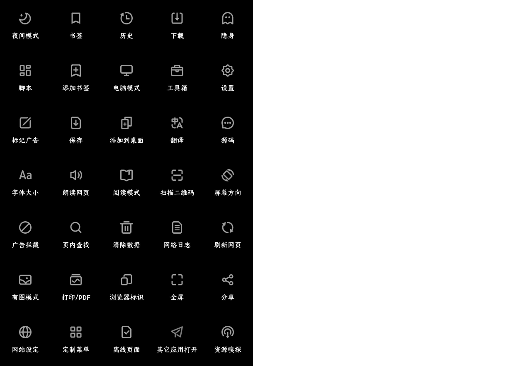

# via小功能或冷门知识

## 💡via设置

### ✧操作设定✧

via大部分手势都是在 设置＞通用＞操作设定内


下方的工具栏各个按钮均可长按来更改功能，也可以整个工具栏左右滑动

同时，这里功能也是比较丰富，如：

“滑动屏幕前进后退”，如果手势冲突就可以关了

“使用音量键翻页”，看小说漫画或许有奇效？

### ✧菜单内长按功能✧

大多图标都是有长按快捷键，这里列举主要的：

<details><summary> ©展开部分按钮的长按功能介绍 </summary>

<br>

> 长按“设置”进入“定制菜单”界面

(普通方式 点击菜单中的“定制菜单” 或 设置＞通用＞定制菜单)

> 长按“电脑模式”可以切换“浏览器标识”

(普通方式 点击菜单中的“浏览器标识”)

> 长按“浏览器标识”进入“浏览器标识”界面

(普通方式 设置＞通用＞浏览器标识)

> 长按“工具箱”进行“资源嗅探”

(普通方式 点击菜单中的“资源嗅探”)

> 长按“添加书签”将网站“添加到桌面”

(普通方式 点击菜单中的“添加到桌面”)

> 长按“标记广告”/“网络日志”进入“自定义规则”界面

(普通方式 设置＞通用＞广告拦截＞自定义规则)

> 长按“翻译”打开翻译菜单，用于切换其他翻译方式

(普通方式 正常翻译失败后会打开)

> 长按“分享”选择对应软件打开当前网页

(普通方式 点击菜单中的“其他应用打开”)

⚠↓下方的长按功能为5.4.0更新内容

> 长按“阅读模式”可以打开阅读设置

(普通方式 设置＞通用＞阅读模式)

> 长按地址栏左侧图标选择“搜索引擎”

</details>

<br>

### ✧特立独行的功能位置✧

> 设置＞高级＞自动展示嗅探按钮

> 设置＞通用＞字体大小＞强制缩放

> 设置＞通用＞广告拦截＞自动展开网页全文

> 历史，左下角点击“标签页”(可以查看最近关闭的标签)<br><details><summary> ©查看快捷键 </summary>长按添加标签(如图)的地方即可直接打开<br> </details>

*****

## 😶‍🌫️隐蔽的功能

1. 标签栏内长按标签


2. 标签左侧长按拖动


3. 大书签页左侧长按拖动


4. 网页转二维码

点击地址栏左侧图标，然后点击如图的二维码图标


5. 自定义阅读模式CSS

使用方法(三种，不是三步)：

①设置＞通用＞阅读模式＞自定义阅读模式css

②阅读模式下长按阅读模式设置里的“更多选项”

③非阅读模式下长按菜单中的“阅读模式”，点击“自定义阅读模式css”(菜单中没找到阅读模式就长按菜单中的“设置”，将“阅读模式”拖入)

<details>

<summary>©阅读模式CSS简易使用教程</summary>

```

/*💾阅读模式主体*/
.via-reader-body{
/*↓网页字体改为默认↓*/
font-family:initial !important;
}
/*💾阅读模式头部整体*/
.via-reader-header{
/*↓调整边距(两条)↓*/
padding:0;
margin-bottom:0;
}
/*💾阅读模式头部-标题*/
.via-reader-header>h1{
/*↓让标题只显示一行(三条)↓*/
overflow:hidden;
white-space:nowrap;
text-overflow:ellipsis;
}
/*💾阅读模式头部-域名*/
.via-reader-header>div:not(a){
/*不知道有什么能改的，先放着*/
}
/*💾阅读模式头部-上一页、目录、下一页*/
.via-reader-header>div>a{
color:red !important;
/*↓去掉下划线↓*/
text-decoration:none !important;
padding:10px 0;
}
/*💾阅读模式内容*/
.via-reader-content{
/*↓限制宽度↓*/
width:92vw !important;
/*↓添加边框↓*/
border:1px solid grey;
/*↓调整边距(两条)*/
margin:20px auto 80px;
padding:10px;
}
/*💾阅读模式内容-调整文字边距*/
.via-reader-content>p{
margin:0;
padding:10px 0;
}
/*💾让文字两端对齐*/
#readability-page-1 > div > p{
text-align:justify !important;
}
/*💾尝试去掉内部边框*/
.via-reader-content *{
box-shadow:0px !important;
border:0 !important;
}
/*💾阅读模式内容-上一页、目录、下一页*/
.via-reader-content>p>a{
color:red !important;
}

```

</details>

*****

## 🧥via图标包(Skins)

使用方法：在地址栏输入v://skins即可进入，点击右上角的添加符号(默认为“+”)找到对应压缩包即可


<details><summary>酷安 @半烟半雨溪桥畔 的图标包合集</summary>

[酷安 _@半烟半雨溪桥畔_ 的图标包合集](https://www.lanzn.com/b0337qg1c)，密码：6666


</details>

<details><summary>酷安 @million先森 的图标包合集</summary>

[酷安 _@million先森_ 的图标包合集](https://www.lanzn.com/b02dx028j)，密码：9sbt


</details>

<details><summary>酷安 @大迈克 的魅族浏览器图标包</summary>

[酷安 _@大迈克_ 的魅族浏览器图标包](https://www.lanzn.com/b012evkxc)，密码：35ug



</details>

<details><summary>酷安 @hjiangs 的ViaRounded7.4图标包</summary>

[酷安 _@hjiangs_ 的ViaRounded7.4图标包](https://lanzoup.com/iaChK1nwib4f)

</details>

*****

## 🪟via主页定制(Via-Home)

<details><summary> ✧完整主页推荐✧ </summary>

1. [自用via定制主页](https://www.lanzn.com/b033jzlxa)，内含使用方法，密码：6666

功能：屏蔽下滑聚焦地址栏，增加下滑聚焦搜索框、双击聚焦搜索框，支持切换搜索引擎，搜索框删中文按钮，简易书签抽屉，点击展示小书签窗口的渐变logo

支持自定义，如有问题可找[酷安@半烟半雨溪桥畔](http://www.coolapk.com/u/20596394)

<details><summary>具体自定义内容展开</summary>


</details>


2. [酷安 _@腿短的二狗子_ 的主页](https://www.lanzn.com/b06eccgmd)，内含使用方法，密码：6666

功能：在主页设置里支持GIF、mp4格式背景，支持显示天气和时间、搜索框左侧切换搜索引擎，搜索框右侧扫描二维码按钮，搜索框上方显示搜索历史，搜索框聚焦下移，完美书签抽屉

支持自定义，如有问题可找[酷安@腿短的二狗子](http://www.coolapk.com/u/3632084)，

<details><summary>具体自定义内容展开</summary>

进入书签抽屉，右上角齿轮即是主页设置 


</details>


</details>

…………………………

单独的主页功能

- [酷安 _@耗子Sky_ 的主页搜索框历史记录](https://bitbucket.org/!api/2.0/snippets/lemon399/aqLxK4/4eeca77988a73c5cbb8a998bf89af21caacd67ae/files/hist.html)

进入链接，将代码全选，然后到设置＞定制＞Logo，选择“HTML代码”，将代码粘贴进去(代码前两行是via的自带logo，如果不需要可以删除)

- [酷安 _@undefined303_ 的主页搜索框提取链接](https://lanzoup.com/iXv4a1bj8uuf)

进入链接，将最新文件下载下来后，将里面的代码复制，然后到设置＞定制＞Logo，选择“HTML代码”，将代码粘贴进去

- [收集的功能(暂含显示时间、天气、诗句)](https://www.lanzn.com/b033s67ib)，密码：6666

*****

## 🎈地址栏新大陆(Scheme)

将下列东西粘贴到地址栏搜索会有奇妙的事情发生哦~

<details>
  <summary> ©展开列表 </summary>
  
  - 沉浸式书签页(实际上就是文件地址)
> file:///data/user/0/mark.via/files/bookmarks.html

- 沉浸式历史页 
> history//

- 小窗口书签页 
> folder://

- 翻译菜单 
> javascript:via.cmd(513)

- 聚焦地址栏 
> javascript:via.cmd(514)

- 标记广告 
> javascript:via.cmd(517)

- 大书签页(书签部分)
> javascript:via.cmd(257)

- 大书签页(历史部分)
> v://history _或_ via://history

- via功能页 
> v:// _或_ via://

- 沉浸式离线页 
> v://offline _或_ via://offline

- 在主页时是小窗口书签页，在其他网页是沉浸式书签页
> v://bookmarks _或_ via://bookmarks

- 图标包切换页 
> v://skins _或_ via://skins

- 使用扫码功能 
> v://scanner _或_ via://scanner

- 打开下载页
> v://downloader _或_ via://downloader

- 调用via搜索(基本是开发者用的)
> v://search _或_ via://search

- 调用via搜索任意关键词(喜欢折腾的可以试试，用外部软件调用via)
> v://search?q=任意关键词 _或_ via://search?q=任意关键词

[官方介绍Scheme文档](https://viayoo.com/zh-cn/docs/about-the-uri-scheme-of-via-for-android.html)

</details>

*****

## 💡有关via的其他推荐

1. [问答专区及使用技巧](FAQ.md)

2. 油猴脚本收藏夹([→戳这看介绍←](script-share.md))

- [→GreasyFork收藏夹(via浏览器可用)地址←](https://greasyfork.org/scripts?filter_locale=0&set=586537)

3. [广告拦截规则+浏览器标识+图标包等](messy-cont.md)

4. [via浏览器各版本的拾穗整理](https://www.sgfox.cc/archives/via-shisui.html)

5. [via历史版本(官方版，豌豆荚链接)](https://m.wandoujia.com/apps/6609177/history)

6. [(via官方教程)使用webdav同步数据](https://viayoo.com/zh-cn/docs/sync-your-data-via-webdav.html)

*****

[返回主页](../README.md)