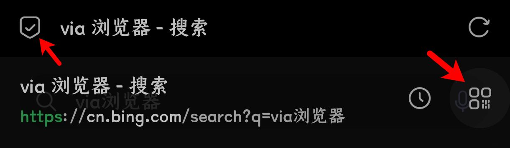

# via小功能或冷门知识

本页目录：  
[✨常规设置](#via%E5%B8%B8%E8%A7%84%E8%AE%BE%E7%BD%AE)--[😶‍🌫️隐蔽功能](#%EF%B8%8F%E9%9A%90%E8%94%BD%E7%9A%84%E5%8A%9F%E8%83%BD) | [🕳长按功能](#%E9%95%BF%E6%8C%89%E5%8A%9F%E8%83%BD) | [👋🏻手势功能](#%E6%89%8B%E5%8A%BF%E5%8A%9F%E8%83%BD)  
[🔮实验设置](#via%E5%AE%9E%E9%AA%8C%E8%AE%BE%E7%BD%AE)--[🧥图标包/皮肤](#via%E5%9B%BE%E6%A0%87%E5%8C%85%E7%9A%AE%E8%82%A4skins) | [🎲其他](#%E5%85%B6%E4%BB%96)  
[🪟主页定制](#via%E4%B8%BB%E9%A1%B5%E5%AE%9A%E5%88%B6via-home) | [🎈地址栏新大陆](#%E5%9C%B0%E5%9D%80%E6%A0%8F%E6%96%B0%E5%A4%A7%E9%99%86scheme) | [💡其他推荐](#%E6%9C%89%E5%85%B3via%E7%9A%84%E5%85%B6%E4%BB%96%E6%8E%A8%E8%8D%90)

## ✨via常规设置

Android版6.0.0版本及以后，via的所有设置界面均可双击页面顶部来返回顶部，包括但不限于书签、历史、脚本、HTML代码、自定义CSS

### ✨😶‍🌫️隐蔽的功能

> 设置＞通用＞网站设定＞字体大小＞强制缩放(注：Android版6.0.0及以后在 设置＞高级 中添加了强制缩放，不过字体大小中仍然有保留)

> 设置＞通用＞广告拦截＞自动展开网页全文

> 关标签时的恢复提醒：历史页左下角点击“标签页”，再左下角点击“更多”，点击“显示撤销关闭标签的提示”

> 显示书签网址：书签页左下角点击“更多”，然后点击“显示细节”

> 网页转二维码：点击地址栏左侧图标，然后点击如图的二维码图标  


> 查看软件报错：设置＞关于，点击via的logo，进入调试信息，可用于查看一些设备信息及软件报错

> 查看拾穗：设置＞关于，点击当前版本号，显示当前版本的拾穗

<details>
<summary>自定义阅读模式CSS</summary>
进入方式(三种，不是三步)：

①设置＞通用＞阅读模式＞自定义阅读模式css

②阅读模式下长按阅读模式设置里的“更多选项”

③非阅读模式下长按菜单中的“阅读模式”，点击“自定义阅读模式css”

<details><summary>示例css代码参考</summary>

```
/*💾阅读模式主体*/
.via-reader-body{
/*↓网页字体改为默认↓*/
font-family:initial !important;
}
/*💾阅读模式头部整体*/
.via-reader-header{
/*↓调整边距(两条)↓*/
padding:0;
margin-bottom:0;
}
/*💾阅读模式头部-标题*/
.via-reader-header>h1{
/*↓让标题只显示一行(三条)↓*/
overflow:hidden;
white-space:nowrap;
text-overflow:ellipsis;
}
/*💾阅读模式头部-域名*/
.via-reader-header>div:not(a){
/*不知道有什么能改的，先放着*/
}
/*💾阅读模式头部-上一页、目录、下一页*/
.via-reader-header>div>a{
color:red !important;
/*↓去掉下划线↓*/
text-decoration:none !important;
padding:10px 0;
}
/*💾阅读模式内容*/
.via-reader-content{
/*↓限制宽度↓*/
width:92vw !important;
/*↓添加边框↓*/
border:1px solid grey;
/*↓调整边距(两条)*/
margin:20px auto 80px;
padding:10px;
}
/*💾阅读模式内容-调整文字边距*/
.via-reader-content>p{
margin:0;
padding:10px 0;
}
/*💾让文字两端对齐*/
#readability-page-1 > div > p{
text-align:justify !important;
}
/*💾尝试去掉内部边框*/
.via-reader-content *{
box-shadow:0px !important;
border:0 !important;
}
/*💾阅读模式内容-上一页、目录、下一页*/
.via-reader-content>p>a{
color:red !important;
}

```
</details></details>

### ✨🕳长按功能

大多图标都是有长按的快捷功能，这里列举主要的：

> 长按菜单中“设置”进入“定制菜单”界面

(普通方式 点击菜单中的“定制菜单” 或 设置＞通用＞定制菜单)

> 长按菜单中“电脑模式”可以切换“浏览器标识”

(普通方式 点击菜单中的“浏览器标识”)

> 长按菜单中“浏览器标识”进入“浏览器标识”界面

(普通方式 设置＞通用＞浏览器标识)

> 长按菜单中“工具箱”进行“资源嗅探”

(普通方式 点击菜单中的“资源嗅探”)

> 长按菜单中“添加书签”将网站“添加到桌面”

(普通方式 点击菜单中的“添加到桌面”)

> 长按菜单中“标记广告”或“网络日志”进入“自定义规则”界面

(普通方式 设置＞通用＞广告拦截＞自定义规则)

> 长按菜单中“翻译”打开翻译菜单，用于切换其他翻译方式

(普通方式 正常翻译失败后会打开)

> 长按菜单中“分享”选择对应软件打开当前网页

(普通方式 点击菜单中的“其他应用打开”)

> 长按菜单中“阅读模式”可以打开阅读设置

(普通方式 设置＞通用＞阅读模式)

> 长按菜单中“网站设定”可以打开网站设定总设置

(普通方式 设置＞通用＞网站设定)

> 长按菜单中“字体大小”可以打开字体大小总设置

(普通方式 设置＞通用＞网站设定＞字体大小)

> 长按地址栏左侧图标选择“搜索引擎”

(普通方式 点击地址搜索栏进入输入状态后，点击左侧图标[默认为放大镜])

> 长按设置＞关于中via的logo 进入webview的开发者工具

还有些额外的长按功能：

> 标签页内长按标签弹出功能菜单  


> 标签页内长按添加符(默认为“+”)进入“最近关闭的标签页”  


(普通方式 历史左下角“标签页”)

> 地址栏长按搜索框弹出功能  

<small>(注：搜索框长按菜单中“复制”出来的为url编码，进入搜索框全选“复制”的是可视文字)</small>

### ✨👋🏻手势功能

via可修改的手势都是在 设置＞通用＞操作设定 内


下方的工具栏各个按钮均可长按来更改功能，也可以整个工具栏左右滑动

不可修改的手势功能有

> 标签页将单标签向左或向右滑动，删除该标签

(普通方式 点击标签页单标签右侧的删除符号[默认为×])

> 标签左侧长按拖动  


> 大书签页左侧长按拖动(名称排序时不支持拖动)


> 拖拽文字入地址栏  
Android版6.1.0版本及以后，支持了拖拽API，其中有将文本拖拽入地址栏的表现  


*****

## 🔮via实验设置

Android版6.3.0及以后，添加了默认不显示的“实验”设置。可在设置页点击标题“设置”五次，然后即可开启

### 🔮🧥via图标包/皮肤(Skins)

在Android版Via4.4.5及以后，可以通过导入图标包的方式替换via自带的大部分图标。Android版6.3.0及以后归入实验设置

使用方法：在地址栏输入v://skins或实验设置中进入，点击右上角的添加符号(默认为“+”)，找到对应压缩包即可


<details><summary>酷安 @半烟半雨溪桥畔 的图标包合集</summary>

[酷安 _@半烟半雨溪桥畔_ 的图标包合集](https://www.lanzn.com/b0337qg1c)，密码：6666


</details>

<details><summary>酷安 @million先森 的图标包合集</summary>

[酷安 _@million先森_ 的图标包合集](https://www.lanzn.com/b02dx028j)，密码：9sbt


</details>

<details><summary>酷安 @大迈克 的魅族浏览器图标包</summary>

[酷安 _@大迈克_ 的魅族浏览器图标包](https://www.lanzn.com/b012evkxc)，密码：35ug


</details>

<details><summary>酷安 @hjiangs 的ViaRounded7.4图标包</summary>

[酷安 _@hjiangs_ 的ViaRounded7.4图标包](https://lanzoup.com/iaChK1nwib4f)

</details>

### 🔮🎲其他

①模糊效果(Android11及以上显示)：目前有两种，背景模糊(Android10及以上均支持)、对话框模糊(如菜单、小窗口，Android12及以上且未阉割)  
效果均为系统实现，所以可能出现对话框模糊在后台进入via短暂失效、壁纸缩放、启用后耗电增加等问题

②在设置中启用背景(Android11及以上显示)：允许via自带的界面以主页壁纸为背景  
非夜间模式会带有半透明白色罩遮、启用模糊效果后，设置里的背景也会有相应模糊

*****

## 🪟via主页定制(Via-Home)

<details><summary> ✧完整主页推荐✧ </summary>

1.[自用via定制主页](https://www.lanzn.com/b033jzlxa)，内含使用方法，密码：6666

功能：屏蔽下滑聚焦地址栏，增加下滑聚焦搜索框、双击聚焦搜索框，支持切换搜索引擎，搜索框删中文按钮，简易书签抽屉，点击展示小书签窗口的渐变logo

支持自定义，如有问题可找[酷安@半烟半雨溪桥畔](http://www.coolapk.com/u/20596394)

<details><summary>具体自定义内容展开</summary>


</details>


2.[酷安 _@腿短的二狗子_ 的主页](https://www.lanzn.com/b06eccgmd)，内含使用方法，密码：6666

功能：在主页设置里支持GIF、mp4格式背景，支持显示天气和时间、搜索框左侧切换搜索引擎，搜索框右侧扫描二维码按钮，搜索框上方显示搜索历史，搜索框聚焦下移，完美书签抽屉

支持自定义，如有问题可找[酷安@腿短的二狗子](http://www.coolapk.com/u/3632084)，

<details><summary>具体自定义内容展开</summary>

进入书签抽屉，右上角齿轮即是主页设置 


</details>


</details>

…………………………

#### 单独的主页功能

-[酷安 _@耗子Sky_ 的主页搜索框历史记录](https://lemon399.gitlab.io/page/code-share-page/code?url=https://lemon399.gitlab.io/page/code-share-page/settings-search-history.txt)

进入链接(如无法进入请尝试使用科学/魔法)，点击“复制”(确保 设置＞通用＞网站设定 未禁用剪贴板权限)，然后根据网站提示放到相应地方

-[酷安 _@undefined303_ 的主页搜索框提取链接](https://wwi.lanzoub.com/b02rdibbi)，密码99ro

进入链接，将最新文件下载下来后，将里面的代码复制，然后到设置＞定制＞Logo，选择“HTML代码”，将代码粘贴进去

-[收集的功能(暂含显示时间、天气、诗句)](https://www.lanzn.com/b033s67ib)，密码：6666

*****

## 🎈地址栏新大陆(Scheme)

将下列东西粘贴到地址栏搜索会有奇妙的事情发生哦~

<details>
  <summary> ©展开列表 </summary>
  
- 沉浸式书签页(实际上就是文件地址)
> file:///data/user/0/mark.via/files/bookmarks.html

- 当前版本拾穗页(实际上也是文件地址)
> file:///data/user/0/mark.via/files/about.html

- 沉浸式历史页 
> history//

- 小窗口书签页 
> folder://

- 翻译菜单 
> javascript:via.cmd(513)

- 聚焦地址栏 
> javascript:via.cmd(514)

- 标记广告 
> javascript:via.cmd(517)

- 大书签页(书签部分)
> javascript:via.cmd(257)

- 大书签页(历史部分)
> v://history _或_ via://history

- via功能页 
> v:// _或_ via://

- 沉浸式离线页 
> v://offline _或_ via://offline

- 在主页时是小窗口书签页，在其他网页是沉浸式书签页
> v://bookmarks _或_ via://bookmarks

- 图标包切换页 
> v://skins _或_ via://skins

- 使用扫码功能 
> v://scanner _或_ via://scanner

- 打开下载页
> v://downloader _或_ via://downloader

- 调用via搜索(基本是开发者用的)
> v://search _或_ via://search

- 调用via搜索任意关键词(喜欢折腾的可以试试，用外部软件调用via)
> v://search?q=任意关键词 _或_ via://search?q=任意关键词

[官方介绍Scheme文档](https://viayoo.com/zh-cn/docs/about-the-uri-scheme-of-via-for-android.html)

</details>

*****

## 💡有关via的其他推荐

1. [问答专区及使用技巧](FAQ.md)

2. [油猴脚本收集列表](script-share.md)([脚本说明](baike/script.md))

3. [广告拦截规则+浏览器标识+图标包等](messy-cont.md)

4. [数据管理(百科中间页)](baike/data.md)

5. [via浏览器各版本的拾穗整理](https://www.sgfox.cc/archives/via-shisui.html)

6. [(via官方教程)使用webdav同步数据](https://viayoo.com/zh-cn/docs/sync-your-data-via-webdav.html)

*****

[返回主页](../README.md)
