# 关于via奇奇怪怪的推荐


## ⚠请使用“[跳转链接修复](https://greasyfork.org/zh-CN/scripts/395970)”脚本跳过Gitee自带的拦截，即下图这个情况

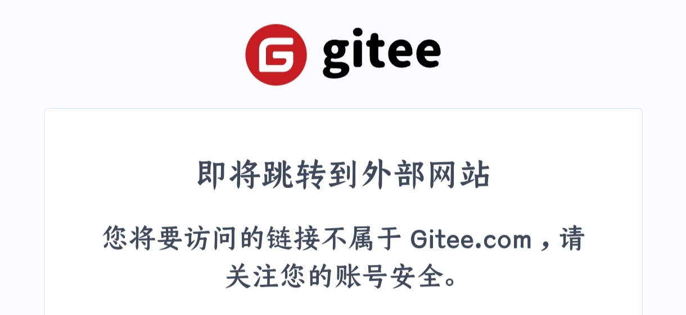

*****

## 💡广告拦截规则(Adblock)
使用方法：
将网址单独复制，然后进入via的设置＞通用＞广告拦截＞规则订阅，点击右上角添加符号(默认为“+”)，选择“自定义”，将下列网址粘贴进去

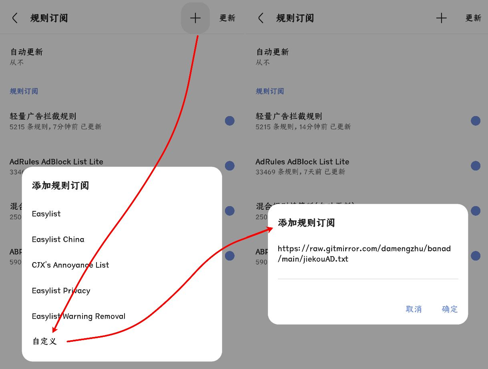

✧部分规则无法更新新请先尝试 开科学/魔法，无果后再尝试反馈作者

主要推荐“[轻量广告拦截规则](https://raw.gitmirror.com/damengzhu/banad/main/jiekouAD.txt)”、"[白名单规则](https://mirror.ghproxy.com/raw.githubusercontent.com/8680/GOODBYEADS/master/allow.txt)"、“[混合规则精简版](https://lingeringsound.github.io/adblock_auto/Rules/adblock_auto_lite.txt)”和“[Ad-J](https://gcore.jsdelivr.net/gh/jk278/Ad-J/Ad-J.txt)”，不误杀就是最好的效果

### 小型规则

<details>
  <summary> ✧展开小型规则列表✧ </summary>

- [Ad-J](https://gcore.jsdelivr.net/gh/jk278/Ad-J/Ad-J.txt)(300+规则)

- [去除APP下载提醒](https://cdn.jsdelivr.net/gh/Noyllopa/NoAppDownload@master/NoAppDownload.txt)(1000+规则)

- [白名单规则](https://mirror.ghproxy.com/raw.githubusercontent.com/8680/GOODBYEADS/master/allow.txt)(4000+规则，唯一一个全部为避免误杀的订阅)

- [轻量广告拦截规则](https://raw.gitmirror.com/damengzhu/banad/main/jiekouAD.txt)(酷安@大萌主，5000+规则)

- [AdGuard Mobile Ads filter](https://filters.adtidy.org/extension/ublock/filters/11.txt)(7000+规则)

- [adgk手机去广告规则](https://raw.githubusercontent.com/banbendalao/ADgk/master/ADgk.txt)(9000+规则，需开科学)

- [混合规则精简版](https://lingeringsound.github.io/adblock_auto/Rules/adblock_auto_lite.txt)(酷安@夕阳醉歌，2w+规则)

- [XXKiller](https://cdn.jsdelivr.net/gh/DoingDog/XXKiller@main/w.txt)(2w+规则)

</details>

### 大型规则

<details>
  <summary> ✧展开大型规则列表✧ </summary>

- [AdKiller-Lite](https://raw.gitmirror.com/PhoenixLjw/AdRules/main/filter-lite.txt)(3w+规则，包含“轻量广告拦截规则”和“去除APP下载提醒”)

- [AdRules AdBlock List Lite](https://adrules.top/adblock_lite.txt)(3w+规则，需开科学)

- [ABP Merge Rules](https://raw.gitmirror.com/damengzhu/abpmerge/main/abpmerge.txt)(5w+规则，包含“轻量广告拦截规则”)

- [AdFilters](https://cdn.jsdelivr.net/gh/o0HalfLife0o/list/ad3.txt)(6w+规则)

- [AdBlock Filter](https://raw.githubusercontent.com/217heidai/adblockfilters/main/rules/adblockfilters.txt)(11w+规则，包含“adgk手机去广告规则”，需开科学)

</details>

### 自定义规则

<details>
  <summary> ✧简单的使用方法✧ </summary>

例如：隐藏百度首页自动播放的视频(因为不是广告，大多规则订阅并不会将其加入)

```
baidu.com##[data-video-play-type="true"]
```

进入via的设置＞通用＞广告拦截＞自定义规则，将规则粘贴进去即可

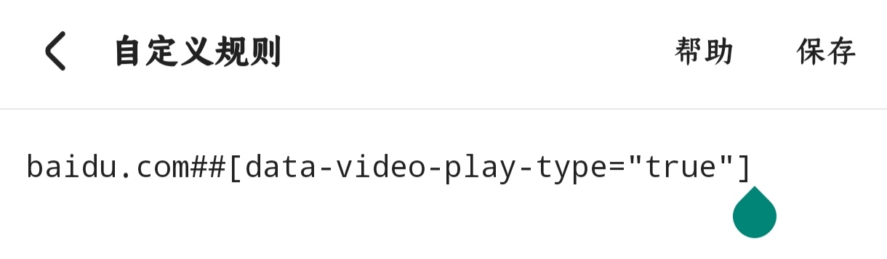
</details>

大多时候你需要隐藏的东西直接在菜单中找到“广告标记”然后选中该部分即可将其纳入自定义规则

### 注意事项
via浏览器目前已经支持广告规则去重(4.5.0)，但重复的规则仍然会拖慢网页加载速度，请适量

<details>
  <summary> 了解详细 </summary>

  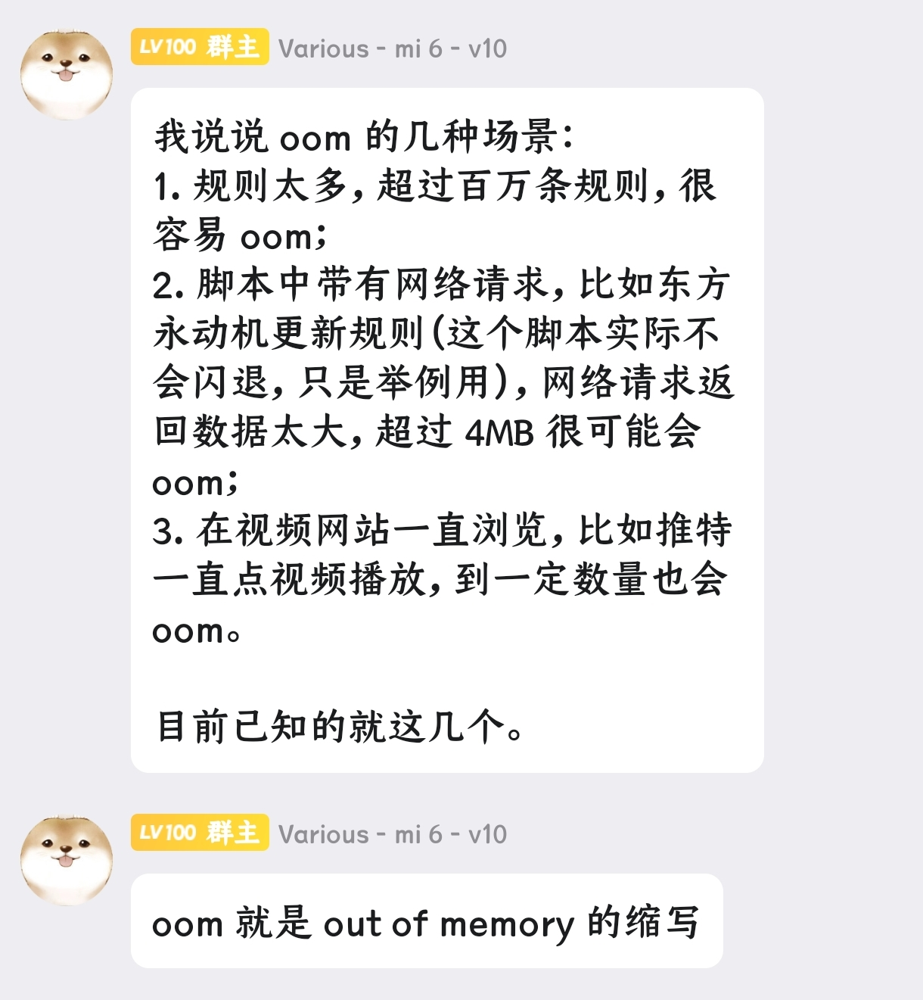

</details>

via浏览器的“启用内建规则”建议开启，如遇误杀直接将问题反馈给官方即可

<details>
  <summary> 了解详细 </summary>

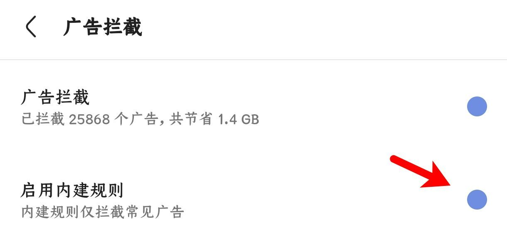

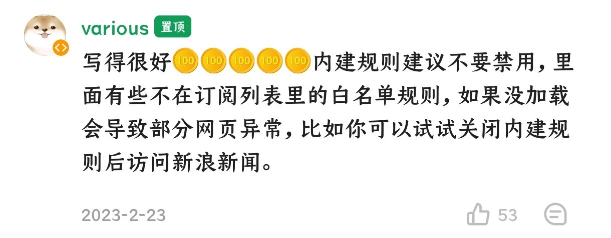

</details>

*****

## 💡浏览器标识(UA)
相当于模拟不同浏览器环境的能力，对于部分站点可以起到去广告和更改样式的作用，单独为网站设定效果更佳

使用方法：设置＞通用＞浏览器标识，点击右上角的添加符号(默认为“+”)，将需添加到UA粘贴进“浏览器标识”框内即可

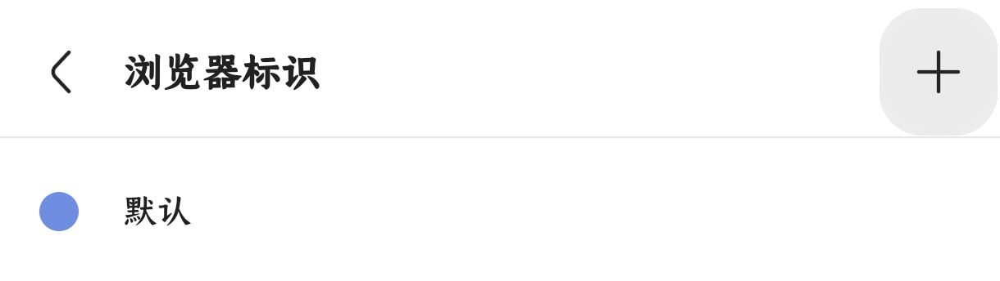

<details>
  <summary> ✧展开推荐UA列表✧ </summary>

1. 简单搜索UA旧版整合

> 优点：百度关自动播放(不缓存)、防拉💩、必应无下载提示 <br> 缺点：没有搜索框、内核可能有点旧

> Mozilla/5.0 (Linux; U; Android 10; zh-CN; 2014811 Build/QQ3A.200805.001) AppleWebKit/537.36 (KHTML, like Gecko) Version/4.0 Chrome/119.0.2564.116 Quark/3.8.2.126 Mobile Safari/537.36 T7/10.3 SearchCraft/2.6.3 (Baidu; P1 8.0.0) edge

2. 简单搜索UA新版 

> 优点：百度有AI、关自动播放、会自动翻页、防拉💩 <br> 缺点：没有搜索框、UI变动大、没有横栏切换、视频仍然会缓存

> Mozilla/5.0 (Linux; Android 10; K) AppleWebKit/537.36 (KHTML, like Gecko) Chrome/120.0.0.0 Mobile Safari/537.36 SearchCraft/3.10.1 ChatSearch/1.0 SearchCraft/5.7.0.5 (Baidu; P1 10)

3. Edge浏览器默认UA 

> 优点：百度关自动播放(不缓存)、有搜索框 <br> 缺点：不防百度拉💩

> Mozilla/5.0 (Linux; Android 10; K) AppleWebKit/537.36 (KHTML, like Gecko) Chrome/117.0.0.0 Mobile Safari/537.36 EdgA/117.0.2045.38

4. 火狐/雨见浏览器默认UA `类似Edge的UA`

> Mozilla/5.0 (Android 14; Mobile; rv:120.0) Gecko/120.0 Firefox/120.0

5. 小米浏览器默认UA 

> 最好是给百度系的单独设置，其他网页可能会加广告

> Mozilla/5.0 (Linux; U; Android 10; zh-cn; BMH-AN10 Build/HUAWEIBMH-AN10) AppleWebKit/537.36 (KHTML, like Gecko) Version/4.0 Chrome/112.0.5615.136 Mobile Safari/537.36 XiaoMi/MiuiBrowser/13.40.2-gn

6. 8.0.49版本微信的UA

>最好是只给提醒“请用微信APP打开”的网站使用

>Mozilla/5.0 (Linux; Android 14; 22081212C Build/UKQ1.230917.001; wv) AppleWebKit/537.36 (KHTML, like Gecko) Version/4.0 Chrome/116.0.0.0 Mobile Safari/537.36 XWEB/1160175 MMWEBSDK/20240404 MMWEBID/7962 MicroMessenger/8.0.49.2600(0x2800313D) WeChat/arm64 Weixin NetType/WIFI Language/zh_CN ABI/arm64

6. 酷安[ _@靈狐_ 自制的日用UA](https://www.coolapk.com/feed/39514762?shareKey=YTg2MDUwZTRhM2FmNjYwYWRhNTg~&shareUid=20596394)

因为自带介绍，而且大佬可能还在更新，这边就直接提供网址了，进去自行复制，[→戳这←](https://aifoxs.gitee.io/user-agent)

</details>

这边不打算更新更多了，提供一个检测UA的网站，也附带了一些常见浏览器的UA

* [UA检测-在线工具](https://useragent.buyaocha.com)


*****

## 💡搜索引擎(Search Engines)

via在5.5.0更新后支持自定义多个搜索引擎，特此添加对应部分方便使用

使用方法：设置＞通用＞搜索引擎，点击右上角的添加符号(默认为“+”)

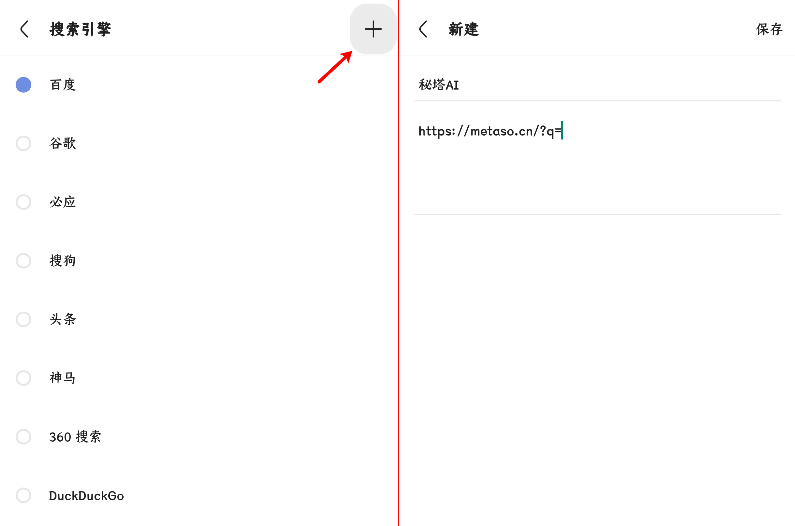

<details><summary>常规搜索引擎列表(暂收录11个)</summary>

> 无追搜索(360搜索的更优解，不收集或跟踪用户数据) <br> https://www.wuzhuiso.com/s?q=

> Whoogle(Google源，目前没墙) <br> https://search.snine.nl/search?q=

> Yandex(俄国的搜索引擎) <br> https://www.yandex.com/search/touch/?text=

> Qwant(法国的搜索引擎，不收集和跟踪用户数据，据说联通搜索挺快的) <br> https://www.qwant.com/?q=

> Swisscows(瑞士的搜索引擎，不收集或跟踪用户数据) <br> https://swisscows.com/en/web?query=

> SearXNG(聚合搜索，目前没墙) <br> https://searx.si/search?q=

> Ecosia(德国的搜索引擎，国内网络会被劫持到Bing) <br> https://www.ecosia.org/search?q=

> Yahoo(日本的搜索引擎，要挂梯) <br> https://search.yahoo.com/search?p=

> Brave(美国的搜索引擎，要挂梯) <br> https://search.brave.com/search?q=

> StartPage(荷兰的搜索引擎，号称世界上最私密的搜索引擎，要挂梯) <br> https://www.startpage.com/sp/search?q=

> Yep(新加坡的搜索引擎，要挂梯) <br> https://yep.com/web?q=

</details>


<details><summary>AI搜索引擎列表(暂收录10个)</summary>

> 秘塔AI <br> https://metaso.cn/?q=

> 天工AI <br> https://www.tiangong.cn/result?q=

> ThinkAnyAI <br> https://thinkany.so/zh/search?q=

> 360AI <br> https://www.sou.com/?q=

> 十号AI <br> https://retardphobia.moebh.org/ui/search.html?q=

> iSouAI <br> https://isou.chat/search?q=

> PhindAI <br> https://phind-ai.com/zh/search?q=

> AndiAI <br> https://andisearch.com/?q=

> iAskAI <br> https://iask.ai/?q=

> PerplexityAI(要挂梯) <br> https://www.perplexity.ai/?q=

</details>

💧夸克搜索引擎其实就是神马搜索(via自带)的换皮并加广告(夸克内没广告是因为其UA可以去自己的广告)，没有必要添加进去

⚠注意：部分搜索引擎有电脑和手机网页的区分，站点可能会自行重定向导致进度条多加载一次，此为正常现象，如果觉得缓慢可以将对应部分换为移动网页样式

*****

## 💡via图标包(Skins)
使用方法：在地址栏输入v://skins即可进入，点击右上角的添加符号(默认为“+”)找到对应压缩包即可

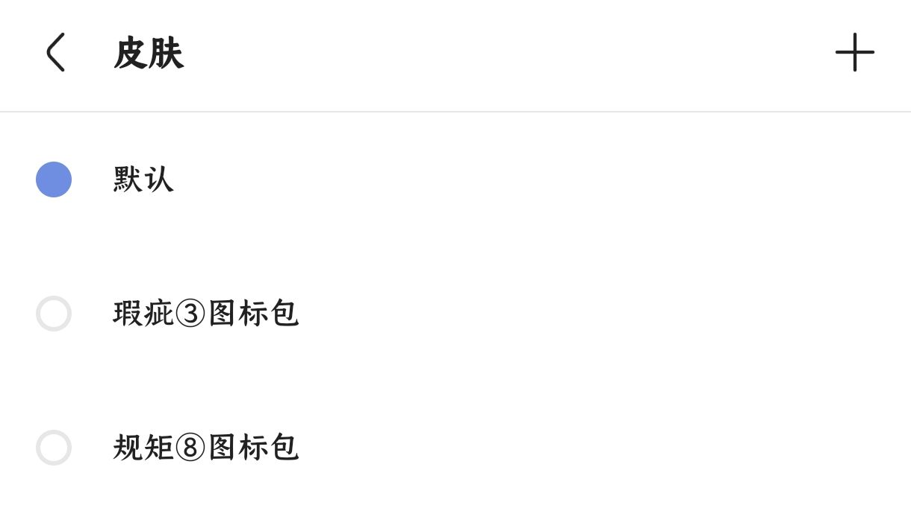

<details><summary>酷安 @半烟半雨溪桥畔 的图标包合集</summary>

[酷安 _@半烟半雨溪桥畔_ 的图标包合集](https://www.lanzn.com/b0337qg1c)，密码：6666

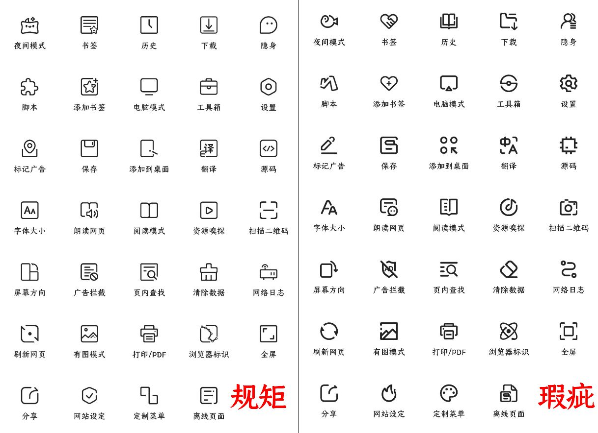

</details>

<details><summary>酷安 @million先森 的图标包合集</summary>

[酷安 _@million先森_ 的图标包合集](https://www.lanzn.com/b02dx028j)，密码：9sbt

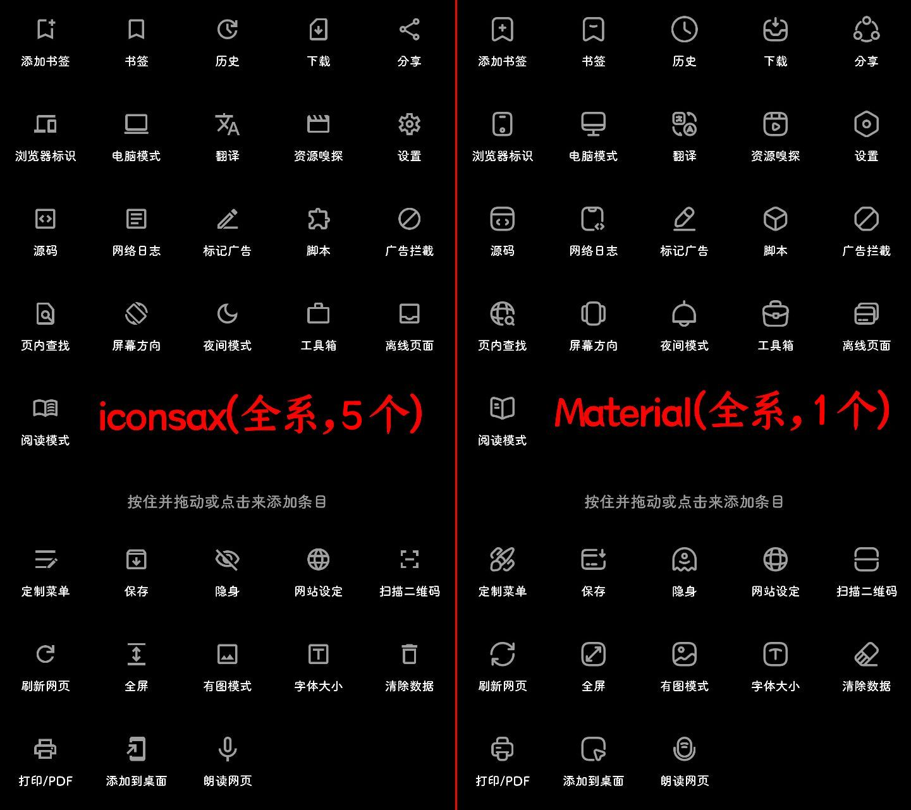

</details>

<details><summary>酷安 @大迈克 的魅族浏览器图标包</summary>

[酷安 _@大迈克_ 的魅族浏览器图标包](https://www.lanzn.com/b012evkxc)，密码：35ug

</details>

<details><summary>酷安 @hjiangs 的ViaRounded7.4图标包</summary>

[酷安 _@hjiangs_ 的ViaRounded7.4图标包](https://lanzoup.com/iaChK1nwib4f)

</details>


*****


## 💡via主页定制(Via-Home)
<details>
  <summary> ✧完整主页推荐✧ </summary>

1. [自用via定制主页](https://www.lanzn.com/b033jzlxa)，内含使用方法，密码：6666

功能：屏蔽下滑聚焦地址栏，增加下滑聚焦搜索框、双击聚焦搜索框，支持切换搜索引擎，搜索框删中文按钮，简易书签抽屉，点击展示小书签窗口的渐变logo

支持自定义，如有问题可找[酷安@半烟半雨溪桥畔](http://www.coolapk.com/u/20596394)
<details>
<summary>具体自定义内容展开</summary>

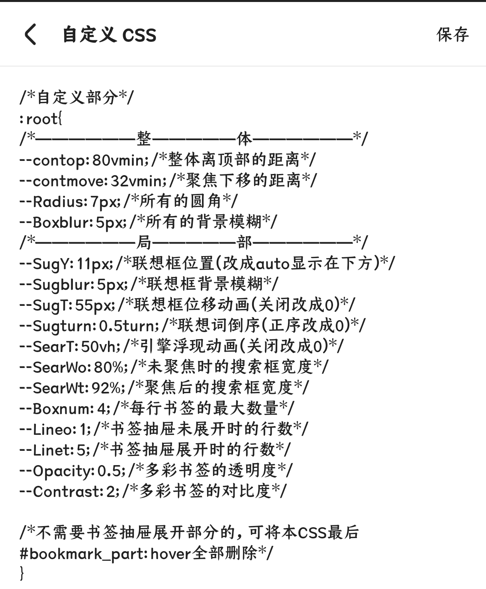

</details>


2. [酷安 _@腿短的二狗子_ 的主页](https://www.lanzn.com/b06eccgmd)，内含使用方法，密码：6666

功能：在主页设置里支持GIF、mp4格式背景，支持显示天气和时间、搜索框左侧切换搜索引擎，搜索框右侧扫描二维码按钮，搜索框(官方问答)Android版 via 常见问题文档上方显示搜索历史，搜索框聚焦下移，完美书签抽屉

支持自定义，如有问题可找[酷安@腿短的二狗子](http://www.coolapk.com/u/3632084)，
<details>
<summary>具体自定义内容展开</summary>

进入书签抽屉，右上角齿轮即是主页设置 

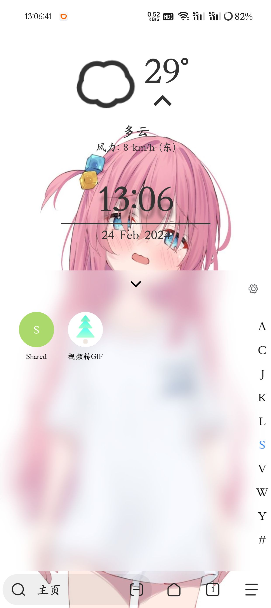

</details>


</details>

…………………………

单独的主页功能

- [酷安 _@耗子Sky_ 的主页搜索框历史记录](https://bitbucket.org/!api/2.0/snippets/lemon399/aqLxK4/4eeca77988a73c5cbb8a998bf89af21caacd67ae/files/hist.html)

进入链接，将代码全选，然后到设置＞定制＞Logo，选择“HTML代码”，将代码粘贴进去(代码前两行是via的自带logo，如果不需要可以删除)

- [酷安 _@undefined303_ 的主页搜索框提取链接](https://lanzoup.com/iXv4a1bj8uuf)

进入链接，将最新文件下载下来后，将里面的代码复制，然后到设置＞定制＞Logo，选择“HTML代码”，将代码粘贴进去

- [收集的功能(暂含显示时间、天气、诗句)](https://www.lanzn.com/b033s67ib)，密码：6666

*****

## 💡其他(Others)
1. 油猴脚本收藏夹([→戳这看介绍←](https://gitee.com/half-dream-half-wake/script-share/blob/master/README.md))
- [→GreasyFork收藏夹(via浏览器可用)地址←](https://greasyfork.org/zh-CN/scripts?set=586537)

2. [via的小功能合集](https://gitee.com/half-dream-half-wake/script-share/blob/master/via-help.md)

3. [via浏览器各版本的拾穗整理](https://www.sgfox.cc/archives/via-shisui.html)

4. [via历史版本(官方版，豌豆荚链接)](https://m.wandoujia.com/apps/6609177/history)

5. [(官方问答)Android版via常见问题文档](https://viayoo.com/zh-cn/docs/via-for-android-faq.html)