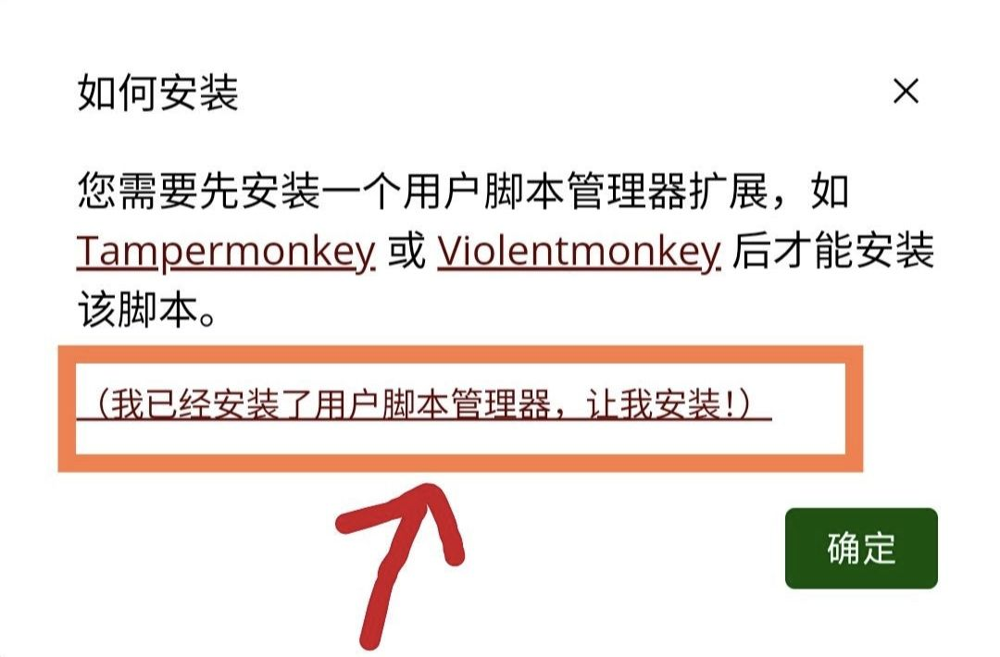

# via浏览器可用油猴脚本分享

## 💡收藏夹地址
⚠via有关油猴脚本的几个重要版本，4.4.2支持，5.6.0兼容性大加强，建议先将via更新为最新版本后食用收藏夹

[→GreasyFork收藏夹(主体推荐篇)地址←](https://greasyfork.org/zh-CN/scripts?filter_locale=0&set=586537)(介绍：都是移动端网页完美使用的，部分还支持电脑网页，主推)

[→GreasyFork收藏夹(PC网页补充篇)地址←](https://greasyfork.org/zh-CN/scripts?filter_locale=0&set=590548)(介绍：不太适合移动端网页更适合电脑网页或者平板使用的、只作用于电脑网页的脚本集)

[→GreasyFork收藏夹(不可说の篇)←](https://greasyfork.org/zh-CN/scripts?filter_locale=0&set=590678)||[→SleazyFork收藏夹(不可说の篇)←](https://sleazyfork.org/zh-CN/scripts?filter_locale=0&set=590678)(介绍：在GreasyFork站点上申请了“包含成人内容”的脚本在未登录的情况下无法看见，未登录的用户就必须在SleazyFork站点上安装)

* **************

> 使用方法：用via浏览器打开此网页，然后进入收藏夹，选择脚本，进入，点击“安装此脚本”，弹出确认安装的窗口后点击确认即安装完毕

* via浏览器自带脚本管理器，无需添加其他脚本管理器，如遇下图提示，请点击框内部分

> ✧注意：本系列收藏夹不包含也不打算包含 网盘/视频解析类脚本，不稳定是其一，还请注意冲浪安全   GreasyFork站点并非只有收藏夹内的脚本可以使用，只是列举本人留意或他人推荐的脚本   去广告功能能用规则订阅就尽量使用规则订阅，效果更好些，可参考[关于via奇奇怪怪的推荐](messy-cont.md)

*****

## 💡近期收录/改动

  
 展开 

- [主体推荐篇](https://greasyfork.org/zh-CN/scripts?filter_locale=0&set=586537)添加[跳转链接修复](https://greasyfork.org/zh-CN/scripts/395970)(替换掉“外链自动跳转”脚本，因为其对网站添加了自己的中间页)[4.27]

- [主体推荐篇](https://greasyfork.org/zh-CN/scripts?filter_locale=0&set=586537)添加[抖音优化](https://greasyfork.org/zh-CN/scripts/494643)(顺便移除了不太好用的“抖音网页版优化”)[5.14]

- [PC网页补充篇](https://greasyfork.org/zh-CN/scripts?filter_locale=0&set=590548)添加[视频网页全屏（改）](https://greasyfork.org/zh-CN/scripts/495077)(实测支持竖屏视频全屏，但脚本作者貌似不想处理移动端出现的问题)[5.16]

- [主体推荐篇](https://greasyfork.org/zh-CN/scripts?filter_locale=0&set=586537)添加[WebRTC禁用脚本](https://greasyfork.org/zh-CN/scripts/495166)(尝试禁止WebRTC泄露ip)[5.16]

- [主体推荐篇](https://greasyfork.org/zh-CN/scripts?filter_locale=0&set=586537)添加了[自动无缝翻页](https://greasyfork.org/zh-CN/scripts/419215)(脚本作者目前已主动兼容)、[字体渲染(自用脚本)](https://greasyfork.org/zh-CN/scripts/416688)和[全新の维基百科](https://greasyfork.org/zh-CN/scripts/495783)[5.23]

- [主体推荐篇](https://greasyfork.org/zh-CN/scripts?filter_locale=0&set=586537)添加[自动展开全文阅读更多](https://greasyfork.org/zh-CN/scripts/440400)(类似自动展开脚本，但这个兼容更多)[5.27]

- [PC网页补充篇](https://greasyfork.org/zh-CN/scripts?filter_locale=0&set=590548)添加[Linkify Plus Plus](https://greasyfork.org/zh-CN/scripts/4255)(悬停后让链接变为可点击的状态，在移动端相当于需要点击两次，最好还是用[让链接可点击](https://greasyfork.org/zh-CN/scripts/473068))[5.31]

- [PC网页补充篇](https://greasyfork.org/zh-CN/scripts?filter_locale=0&set=590548)添加[all-search全搜](https://greasyfork.org/zh-CN/scripts/397993)(快捷切换搜索引擎，但使用方式上有点不太适合移动端，如觉得膈应可换为[聚合搜索引擎切换导航[手机版][移动端]](https://greasyfork.org/zh-CN/scripts/462130) 或 [ 搜索引擎切换器2(侧栏版)](https://greasyfork.org/zh-CN/scripts/489235))[6.4]

- [主体推荐篇](https://greasyfork.org/zh-CN/scripts?filter_locale=0&set=586537)添加[北极小狐大佬](https://greasyfork.org/zh-CN/users/747162)的[Atcoder Better!](https://greasyfork.org/zh-CN/scripts/471106)、[AcWing Better!](https://greasyfork.org/zh-CN/scripts/464981)、[Codeforces Better!](https://greasyfork.org/zh-CN/scripts/465777)[6.5]

- [主体推荐篇](https://greasyfork.org/zh-CN/scripts?filter_locale=0&set=586537)添加[【移动端】bilibili优化](https://greasyfork.org/zh-CN/scripts/494644)(登录后拥有媲美APP的体验，顺便删除了有些功能失效的[哔哩哔哩超强防护](https://greasyfork.org/zh-CN/scripts/458276))[6.6]

- [主体推荐篇](https://greasyfork.org/zh-CN/scripts?filter_locale=0&set=586537)添加[YouTube视频&音乐&儿童广告拦截](https://greasyfork.org/zh-CN/scripts/480192)(顺便移除了失效的“YouTube去广告”脚本)[6.11]

- [主体推荐篇](https://greasyfork.org/zh-CN/scripts?filter_locale=0&set=586537)添加[帧率FPS显示](https://greasyfork.org/zh-CN/scripts/498194)[6.21]

- [主体推荐篇](https://greasyfork.org/zh-CN/scripts?filter_locale=0&set=586537)添加[HTTP重定向至HTTPS](https://greasyfork.org/zh-CN/scripts/495629)(顺便移除了不太好用的“HTTP重定向为HTTPS”)[6.29]

- [主体推荐篇](https://greasyfork.org/zh-CN/scripts?filter_locale=0&set=586537)添加[Github搜索净化](https://greasyfork.org/zh-CN/scripts/473912)(我来GitHub是来看开源项目学习的，不是来看反贼的)[6.29]

- [不可说の篇](https://sleazyfork.org/zh-CN/scripts?filter_locale=0&set=590678)添加[ComicRead](https://greasyfork.org/zh-CN/scripts/493257)[6.29]

- [主体推荐篇](https://greasyfork.org/zh-CN/scripts?filter_locale=0&set=586537)添加[网站综合去元素框架](https://greasyfork.org/zh-CN/scripts/498122)[6.29]

- [主体推荐篇](https://greasyfork.org/zh-CN/scripts?filter_locale=0&set=586537)添加[移动端微软Rewards每日任务脚本](https://greasyfork.org/zh-CN/scripts/480355)[6.29]

- [PC网页补充篇](https://greasyfork.org/zh-CN/scripts?filter_locale=0&set=590548)添加[Microsoft Bing Rewards每日任务脚本](https://greasyfork.org/zh-CN/scripts/477107)(和上面的脚本功能类似，只不过手机电脑网页有所不同)[6.29]

*****

## 💡可以停用的脚本

  
 展开 

在via浏览器的持续更新下，不少脚本都有了可以替代的设置，如：

- [通用阅读器](https://greasyfork.org/zh-CN/scripts/377230)、[Circle阅读助手脚本版](https://greasyfork.org/zh-CN/scripts/440132)→长按菜单中的“设置”将“阅读模式”移入 或 点击地址栏左侧图标再点击“打开阅读模式”(5.4.0)

- [滚动条-新](https://greasyfork.org/zh-CN/scripts/465037)→5.4.0以后自带，5.6.0及以后的最好用

- [大声朗读-TTS辅助阅读](https://greasyfork.org/zh-CN/scripts/429810)→长按菜单中的“设置”将“朗读网页”移入(5.3.0)

- [MutliQRCode扫描页内二维码](https://greasyfork.org/zh-CN/scripts/467200)→长按任意图片，点击“扫描二维码”(5.2.0)

## 💡GreasyFork外的脚本

  
 展开 

一些脚本不在收藏夹内，需要在此页面查看，如：

1.[可以把本地字体生成脚本的软件](https://lanzoup.com/i7DE10yex0qd)，密码：dmpap

2.[沉浸式翻译最新版](https://download.immersivetranslate.com/immersive-translate.user.js)(进入自动弹出安装窗口) 

3.[夸克书签导出](https://gitee.com/mulingLHY/shared_sources/raw/master/convertBookmark_Quark2Via.user.js)(进入自动弹出安装窗口) 

[→脚本作者演示该脚本的使用方法←](https://www.bilibili.com/video/BV1DM411R7vP/)

4.[媒体资源下载脚本](https://blog.luckly-mjw.cn/tool-show/media-source-extract/media-source-extract.user.js)和[m3u8下载器脚本](https://blog.luckly-mjw.cn/tool-show/m3u8-downloader/m3u8-downloader.user.js)配套使用(进入自动弹出安装窗口)
都装好后可以随便点入一个含视频的链接测试效果，对于普通的mp4格式视频可以直接使用，m3u8格式就只能看完后下载，下载后如果音频(m4a)和视频(mp4)是分离的，就只能用[专属视频播放器](http://blog.luckly-mjw.cn/tool-show/media-source-extract/player/player.html)来播放，然后合并下载

5.[DeepL翻译文件](https://doc.deeplx.net/deepl-translator/deepl-translator.user.js)(进入自动弹出安装窗口)
第一次进入会提示“会话已过期”，这是正常现象，刷新重进后即可正常使用(会显示“正在使用DeepL Pro” 代表正常运行)，至于未来会不会失效我也不知道
(注意此脚本不是翻译其他网页，而是在deepl网页上可以一直使用翻译，deepl的翻译挺好用的)

6.未检验的其他脚本站，如果想找可以自己试试

> [用户脚本聚合搜索Userscript](https://www.userscript.zone/)，但好像很久没更新来源了   [开源用户脚本Openuserjs](https://openuserjs.org/)，类似greasyfork但不支持语言分区   [GitHub中搜索脚本](https://github.com/search?q===UserScript==)，可以说基本没有中文   [脚本猫列表ScriptCat](https://scriptcat.org/zh-CN/search)，有少量更新，但与greasyfork站点上有点重叠

*****

## 💡设置页须知

via浏览器更新5.0后便支持脚本设置，打开方式有两种：

* ①点击地址栏左侧图标(默认图标是护盾)，然后点击“脚本”

* ②长按菜单中的“设置”，然后将“脚本”移入菜单，后续便可在菜单中直接使用

* **************

1. 许多脚本都是有自己的脚本设置，例如：[东方永页机](https://greasyfork.org/zh-CN/scripts/438684)、[网页加速器](https://greasyfork.org/zh-CN/scripts/487625)、[知乎修改器移动版](https://greasyfork.org/zh-CN/scripts/488508)和[WhiteSevs大佬的脚本](https://greasyfork.org/zh-CN/users/521923-whitesevs)等等

2. 除了脚本设置外，也有少部分脚本配置较为繁琐，拥有自己的配置网页，例如：[东方永页机配置页](https://hoothin.github.io/UserScripts/Pagetual) 请自行留意收藏夹内的脚本介绍

3. 适配非常多网页的脚本可能会需要诸如“外置规则”的东西，这种一般是留存在GitHub等可能被“墙”屏蔽了的网站中，需要自行 科学/魔法

4. 为什么via无法使用的脚本较多？
内置脚本管理器有利有弊，利在简易好处理、与浏览器完美适配，弊在受浏览器限制(如下图的一、二)

*****

## 💡有关via的其他推荐

[广告拦截规则+浏览器标识+图标包等](messy-cont.md)

[via浏览器自带的一些冷门小功能](via-help.md)

[via浏览器的QQ频道](https://pd.qq.com/s/142yif2dj)

[(官方问答)Android版via常见问题文档](https://viayoo.com/zh-cn/docs/via-for-android-faq.html)

*****

## 💡脚本简易分类/介绍

  
 ✧翻译/汉化/语言类(11个)✧ 

- [简约翻译KISS Translator](https://greasyfork.org/zh-CN/scripts/472840)

> 开源，功能齐全，翻译策略默认为先翻译当前视口，后续实时翻译(可更改)，翻译速度快。缺点就是大多地方需要自己改，功能有点多可能不好找

- [网页中英双显互译](https://greasyfork.org/zh-CN/scripts/469073)

> 开源，功能齐全(相比kiss缺少划词翻译)，翻译策略为一整个网页同时翻译(不可更改)，所以在对待长网页时可能会出现卡顿的现象

- [沉浸式翻译最新版](https://download.immersivetranslate.com/immersive-translate.user.js)(进入自动弹出安装窗口)

> 商业化，功能齐全(相比kiss缺少划词翻译)，翻译策略为先翻译当前视口(可更改)，后续实时翻译，翻译速度适中

- [网页翻译——翻译为中文](https://greasyfork.org/zh-CN/scripts/424966)

> 开源，只有通过谷歌翻译将原文变为译文的功能，需要挂🅅🄿🄽所以就不参与比较翻译速度了

- [划词翻译:多词典查询](https://greasyfork.org/zh-CN/scripts/376313)

> 仅划词翻译，选中文字后长按再点击翻译按钮即可，第一个按钮是聚合翻译展示多个结果，第二个按钮是谷歌翻译

- [简繁自由切换](https://greasyfork.org/zh-CN/scripts/24300)

> 字面意思，目前见过最好的替换脚本，装上后刷新该网页即可对脚本进行配置

- [GitHub中文化插件](https://greasyfork.org/zh-CN/scripts/435208)(尽可能的汉化了)

- [EhSyringe](https://greasyfork.org/zh-CN/scripts/407833)(E站几乎完美的汉化)

- [Youtube双语字幕全平台](https://greasyfork.org/zh-CN/scripts/464879)(视频双语字幕，需设置开启)

- [Pokemon Showdown完整汉化](https://greasyfork.org/zh-CN/scripts/484270)(网页游戏“宝可梦对战”的汉化) 和[ Milky Way Idle汉化](https://greasyfork.org/zh-CN/scripts/490242)(网页游戏“银河奶牛放置”的汉化)

  
 ✧网页浏览强化类(29个)✧ 

- [东方永页机](https://greasyfork.org/zh-CN/scripts/438684)(用通用规则给网页自动翻页，需使用外置规则，可以通过[东方永页机配置页](https://hoothin.github.io/UserScripts/Pagetual/)来更新外置规则和更改脚本设置) 或 [ 自动无缝翻页](https://greasyfork.org/zh-CN/scripts/419215)(用对应规则给脚本翻页，外置规则可在脚本菜单中更新)

- [复制限制解除(本地版)](https://greasyfork.org/zh-CN/scripts/487607) 和 [ 强制复制](https://greasyfork.org/zh-CN/scripts/458145)

- [外链自动重定向](https://greasyfork.org/zh-CN/scripts/462796) 或[ 跳转链接修复](https://greasyfork.org/zh-CN/scripts/395970)(跳过可能存在的中间页(如：知乎安全提醒)直达正确链接，前者匹配所有网页，后者只匹配对应网页，怕误伤用后者，网站小众用前者)

- [⭐网页瞬间加载/跳过进度条直接加载网页⭐](https://greasyfork.org/zh-CN/scripts/493851) 和[ 网页加速器](https://greasyfork.org/zh-CN/scripts/487625)(前者打开页面即开始预加载，后者悬停在链接上后才预加载，两者功能类似，加速打开网页，可在脚本菜单中查看加速次数)

- [手机浏览器触摸手势](https://greasyfork.org/zh-CN/scripts/375806)(手势齐全也支持自定义，缺点可能就是脚本持续活跃，占用和网络消耗大一些)

- [手机助手](https://greasyfork.org/zh-CN/scripts/471432)(脚本页介绍比较全，个人觉得总有用得上的)

- [自动展开](https://greasyfork.org/zh-CN/scripts/438656) 和[ 自动展开全文阅读更多](https://greasyfork.org/zh-CN/scripts/440400)(两个脚本都是将不完整的文章或网页完全展开，第二个目前适配网站更多)

- [骚扰拦截](https://greasyfork.org/zh-CN/scripts/440871)(去除对应站点的“登录”、“使用APP打开”和悬浮弹窗)

- [防止未经授权的自动复制](https://greasyfork.org/zh-CN/scripts/461625)(尽可能拦截某些站点频繁写入剪贴板的行为)

- [网页调试](https://greasyfork.org/zh-CN/scripts/475228)(类似电脑浏览器F12打开的控制台，可在脚本菜单中切换不同的调试工具)

- [搜索引擎去广告](https://greasyfork.org/zh-CN/scripts/437351) 和 [ 网站综合去元素框架](https://greasyfork.org/zh-CN/scripts/498122)(去广告脚本，前者专注于去除搜索引擎上的广告，后者用于其他常用网站，添加站点可在脚本反馈区询问)

- [聚合搜索引擎切换导航[手机版][移动端]](https://greasyfork.org/zh-CN/scripts/462130) 、 [ 搜索引擎切换器2(侧栏版)](https://greasyfork.org/zh-CN/scripts/489235) 和 [ all-search全搜](https://greasyfork.org/zh-CN/scripts/397993)(第一个显示在页面顶部，第二个显示在页面左侧，功能类似；最后一个移动端可以用但主要适合电脑网页)

- [【移动端】百度系优化](https://greasyfork.org/zh-CN/scripts/418349)(对百度系列的所有网站进行处理，功能丰富，可在脚本菜单自定义)

- [边缘下滑刷新•改](https://greasyfork.org/zh-CN/scripts/482126)

- [记录页面滚动](https://greasyfork.org/zh-CN/scripts/483745)(记录该网站上一次的位置，网页加载完毕后自动回到原位置，可惜不支持单独站点开关)

- [中英文之间加空白](https://greasyfork.org/zh-CN/scripts/470865)(在中文与英文/数字间穿插空格，让页面布局更符合直观感受)

- [滚动到顶/底](https://greasyfork.org/zh-CN/scripts/482125)(一个按钮满足直达网站顶部或底部)

- [黑白网页恢复彩色](https://greasyfork.org/zh-CN/scripts/455684)(不是不尊重，而是希望能有所选择)

- [强制缩放与桌面模式](https://greasyfork.org/zh-CN/scripts/450368)

- [字体渲染(自用脚本)](https://greasyfork.org/zh-CN/scripts/416688)(将字体渲染的更为清晰，可在脚本菜单中自定义) 或[ Mactype助手](https://greasyfork.org/zh-CN/scripts/436451)(将字体加粗、变清晰)

- [网页文字编辑](https://greasyfork.org/zh-CN/scripts/490902)(脚本菜单中更改网页的可编辑状态，在无法复制的网页效果更佳)

  
 ✧视频/图片/链接(17个)✧ 

- [俺的手机视频脚本](https://greasyfork.org/zh-CN/scripts/456542)(专门用于视频功能的脚本，和“手机浏览器触摸手势”、“触摸屏视频优化”一起使用时注意手势冲突问题)

- [触摸屏视频优化](https://greasyfork.org/zh-CN/scripts/405897)(类似上一个脚本，侧重不同)

- [视频网页全屏（改）](https://greasyfork.org/zh-CN/scripts/495077)

- [在线看图工具Picviewer CE+](https://greasyfork.org/zh-CN/scripts/24204)(点开图片后支持图片翻转、旋转、缩放、弹出大图、批量保存)

- [图片全载-FancyboxV5](https://greasyfork.org/zh-CN/scripts/463305)(主要用于方便看漫画、下载打包图片)

- [ComicRead](https://greasyfork.org/zh-CN/scripts/493257)

- [链接助手](https://greasyfork.org/zh-CN/scripts/464541)(强制新标签页打开链接，让符合条件的链接文本变为超链接)

- [链接地址洗白白](https://greasyfork.org/zh-CN/scripts/373270)(将链接缩短为最小可用状态、复制链接、带标题的复制链接……)

- [让链接可点击](https://greasyfork.org/zh-CN/scripts/473068) 和[ Linkify Plus Plus](https://greasyfork.org/zh-CN/scripts/4255)(前者直接把所有链接变为可点击，后者只把悬停过的链接变为可点击，各有优劣)

- [网盘链接识别](https://greasyfork.org/zh-CN/scripts/445489)(识别出网页中存在相应网盘的链接时，出现提醒，几乎支持所有常用网盘)

- [网盘自动填写访问码via](https://greasyfork.org/zh-CN/scripts/493360)

- [链接管理](https://greasyfork.org/zh-CN/scripts/443670)(让指定站点重定向到正确的链接，支持部分直达中文站点)

- [地址精简](https://greasyfork.org/zh-CN/scripts/429294)(去除适配站点链接中的冗余部分，缩短链接)

- [新标签页打开链接](https://greasyfork.org/zh-CN/scripts/429714)(强制让链接以新标签形式打开)

- [在当前标签页中打开链接](https://greasyfork.org/zh-CN/scripts/461352)(与上一个脚本相反，强制让链接在当前标签打开链接)

- [图片样式屏蔽器](https://greasyfork.org/zh-CN/scripts/487681)(默认无效果，需在脚本菜单中启用，相比“无图模式”，脚本多屏蔽了图片的样式)

- [FloatingPlayer悬浮窗播放器](https://greasyfork.org/zh-CN/scripts/449323)(网页上的悬浮窗视频，但不支持双指缩放、关闭视频、退回网页，个人觉得不太好使)

- [via浏览器本地密码填充](https://greasyfork.org/zh-CN/scripts/476252)

  
 ✧作用于单一站点(36个)✧ 

- [蓝奏云重定向+记住密码](https://greasyfork.org/zh-CN/scripts/488847) 或 [ 蓝奏云自动点击下载](https://greasyfork.org/zh-CN/scripts/489281)(脚本功能开始冲突了，主推前者更适合via)

- [123盘自动填写提取码](https://greasyfork.org/zh-CN/scripts/489660) 和 [ 隐藏123云盘广告并调整下载按钮位置](https://greasyfork.org/zh-CN/scripts/489267)(合用基本上就是完美体验了)

- [知乎修改器移动版](https://greasyfork.org/zh-CN/scripts/488508) 或 [ 知乎直接看](https://greasyfork.org/zh-CN/scripts/457609)(脚本有兼容问题，主推前者功能更丰富)

- [【移动端】微博优化](https://greasyfork.org/zh-CN/scripts/480094)

- [简书优化](https://greasyfork.org/zh-CN/scripts/485483)

- [CSDN优化](https://greasyfork.org/zh-CN/scripts/406136) 和 [ CSDN超强防护](https://greasyfork.org/zh-CN/scripts/458601)

- [GreasyFork优化](https://greasyfork.org/zh-CN/scripts/475722) 和 [ 大人的Greasyfork](https://greasyfork.org/zh-CN/scripts/23840)

- [移动百度优化](https://greasyfork.org/zh-CN/scripts/436841)(只在百度引擎里加了一个搜索框，避免因为UA没有搜索框的尴尬)

- [手机百度搜索净化](https://greasyfork.org/zh-CN/scripts/467204) 和 [ 禁止百度搜索自动播放视频和禁止粘贴板口令](https://greasyfork.org/zh-CN/scripts/470469)

- [【移动端】bilibili优化](https://greasyfork.org/zh-CN/scripts/494644) 、[bilibili移动端](https://greasyfork.org/zh-CN/scripts/490548) 和 [ bilibili移动端Lite](https://greasyfork.org/zh-CN/scripts/468246) 和(第一个是优化移动端网页的所有问题，功能多；第二个是将电脑端网页变为适配移动端网页的样式；第三个与第二个配套，是适用移动端网页，功能少点)

- [抖音优化](https://greasyfork.org/zh-CN/scripts/494643)

- [【移动端】小红书优化](https://greasyfork.org/zh-CN/scripts/483960)

- [手机网页版IT之家去除广告和干扰](https://greasyfork.org/zh-CN/scripts/396190)

- [💡WebPreview-信息直达](https://greasyfork.org/zh-CN/scripts/462463)(给Bing和Google搜索引擎添加一个按钮用于预览网页内容)

- [Xbox CLoud Gaming 优化整合](https://greasyfork.org/zh-CN/scripts/455741)(云游戏在线玩)

- [MT论坛](https://greasyfork.org/zh-CN/scripts/401359)

- [移动端微软Rewards每日任务脚本](https://greasyfork.org/zh-CN/scripts/480355) 和 [ Microsoft Bing Rewards每日任务脚本](https://greasyfork.org/zh-CN/scripts/477107)(前者适用移动网页，后者适用电脑网页，相关注意事项可询问脚本作者)

- [V2Next-Mobile](https://greasyfork.org/zh-CN/scripts/485356) 和 [ V2Next](https://greasyfork.org/zh-CN/scripts/458024)(V2EX论坛(或称V站)优化脚本，前者适用移动网页，后者适用电脑网页，相关注意事项可询问脚本作者)

- [Pixiv增强](https://greasyfork.org/zh-CN/scripts/34153)

- [Github搜索净化](https://greasyfork.org/zh-CN/scripts/473912)

- [YouTube视频&音乐&儿童广告拦截](https://greasyfork.org/zh-CN/scripts/480192)

- [ColaManga浏览增强](https://greasyfork.org/zh-CN/scripts/488622)

- [DeepL翻译文件](https://doc.deeplx.net/deepl-translator/deepl-translator.user.js)(让你在deepl的网页上成为deepl pro，即可以无限制翻译)

- [全新の维基百科](https://greasyfork.org/zh-CN/scripts/495783)(更改维基百科的样式，让其看上去更舒服)

- [水木社区web转APP](https://greasyfork.org/zh-CN/scripts/466317)(将网页端水木社区搞成适配手机网页的形态)

- [Atcoder Better!](https://greasyfork.org/zh-CN/scripts/471106)

- [AcWing Better!](https://greasyfork.org/zh-CN/scripts/464981)

- [Codeforces Better!](https://greasyfork.org/zh-CN/scripts/465777)

  
 ✧可能用得上(13个)✧ 

- [护眼模式](https://greasyfork.org/zh-CN/scripts/426377) 和 [ 🌙 高级定制网页护眼模式🌙](https://greasyfork.org/zh-CN/scripts/485513)

- [HTTP重定向至HTTPS](https://greasyfork.org/zh-CN/scripts/495629)(可以用此尝试避免一些HTTP协议导致的DNS污染，不过可能治标不治本)

- [仿via资源嗅探](https://greasyfork.org/zh-CN/scripts/471390)(模仿via自带的资源嗅探，在脚本菜单中显示嗅探到的音频、视频)

- [WebRTC禁用脚本](https://greasyfork.org/zh-CN/scripts/495166)(尝试禁止WebRTC泄露ip)

- [浏览器背景](https://greasyfork.org/zh-CN/scripts/493937)(将浏览器的背景变成某只笨蛋~，可以按注释自行更换图片)

- [Userscript+--](https://greasyfork.org/zh-CN/scripts/409727)(在脚本菜单中显示当前站点的可能适用的脚本数，点击可以跳转到GreasyFork里搜索)

- [网页看板娘](https://greasyfork.org/zh-CN/scripts/483088)(在浏览器窗口上养一只赛博老婆)

- [自动滚动：双击切换滚动状态](https://greasyfork.org/zh-CN/scripts/492138)(适合看小说的时候用用)

- [保持屏幕常亮：唤醒锁定](https://greasyfork.org/zh-CN/scripts/494378)

- [自动滚动配置](https://greasyfork.org/zh-CN/scripts/487297)(在页面上添加一个可以配置自动滚动的设置)

- [点击波纹特效](https://greasyfork.org/zh-CN/scripts/482952)(更直观的触屏点击效果，可在脚本菜单自定义)

- [帧率FPS显示](https://greasyfork.org/zh-CN/scripts/498194)

*****

[返回主页](README.md)
- [网页中英双显互译](https://greasyfork.org/zh-CN/scripts/469073)

> 开源，功能齐全(相比kiss缺少划词翻译)，翻译策略为一整个网页同时翻译(不可更改)，所以在对待长网页时可能会出现卡顿的现象

- [沉浸式翻译最新版](https://download.immersivetranslate.com/immersive-translate.user.js)(进入自动弹出安装窗口)

> 商业化，功能齐全(相比kiss缺少划词翻译)，翻译策略为先翻译当前视口(可更改)，后续实时翻译，翻译速度适中

- [网页翻译——翻译为中文](https://greasyfork.org/zh-CN/scripts/424966)

> 开源，只有通过谷歌翻译将原文变为译文的功能，需要挂🅅🄿🄽所以就不参与比较翻译速度了

- [划词翻译:多词典查询](https://greasyfork.org/zh-CN/scripts/376313)

> 仅划词翻译，选中文字后长按再点击翻译按钮即可，第一个按钮是聚合翻译展示多个结果，第二个按钮是谷歌翻译

- [简繁自由切换](https://greasyfork.org/zh-CN/scripts/24300)

> 字面意思，目前见过最好的替换脚本，装上后刷新该网页即可对脚本进行配置

- [GitHub中文化插件](https://greasyfork.org/zh-CN/scripts/435208)(尽可能的汉化了)

- [EhSyringe](https://greasyfork.org/zh-CN/scripts/407833)(E站几乎完美的汉化)

- [Youtube双语字幕全平台](https://greasyfork.org/zh-CN/scripts/464879)(视频双语字幕，需设置开启)

- [Pokemon Showdown完整汉化](https://greasyfork.org/zh-CN/scripts/484270)(网页游戏“宝可梦对战”的汉化) 和[ Milky Way Idle汉化](https://greasyfork.org/zh-CN/scripts/490242)(网页游戏“银河奶牛放置”的汉化)

  
 ✧网页浏览强化类(26个)✧ 

- [东方永页机](https://greasyfork.org/zh-CN/scripts/438684)(用通用规则给网页自动翻页，需使用外置规则，可以通过[东方永页机配置页](https://hoothin.github.io/UserScripts/Pagetual/)来更新外置规则和更改脚本设置) 或 [ 自动无缝翻页](https://greasyfork.org/zh-CN/scripts/419215)(用对应规则给脚本翻页，外置规则可在脚本菜单中更新)

- [复制限制解除(本地版)](https://greasyfork.org/zh-CN/scripts/487607) 和 [ 强制复制](https://greasyfork.org/zh-CN/scripts/458145)

- [外链自动重定向](https://greasyfork.org/zh-CN/scripts/462796) 或[ 跳转链接修复](https://greasyfork.org/zh-CN/scripts/395970)(跳过可能存在的中间页(如：知乎安全提醒)直达正确链接，前者匹配所有网页，后者只匹配对应网页，怕误伤用后者，网站小众用前者)

- [⭐网页瞬间加载/跳过进度条直接加载网页⭐](https://greasyfork.org/zh-CN/scripts/493851) 和[ 网页加速器](https://greasyfork.org/zh-CN/scripts/487625)(前者打开页面即开始预加载，后者悬停在链接上后才预加载，两者功能类似，加速打开网页，可在脚本菜单中查看加速次数)

- [手机浏览器触摸手势](https://greasyfork.org/zh-CN/scripts/375806)(手势齐全也支持自定义，缺点可能就是脚本持续活跃，占用和网络消耗大一些)

- [手机助手](https://greasyfork.org/zh-CN/scripts/471432)(脚本页介绍比较全，个人觉得总有用得上的)

- [自动展开](https://greasyfork.org/zh-CN/scripts/438656) 和[ 自动展开全文阅读更多](https://greasyfork.org/zh-CN/scripts/440400)(两个脚本都是将不完整的文章或网页完全展开，第二个目前适配网站更多)

- [骚扰拦截](https://greasyfork.org/zh-CN/scripts/440871)(去除对应站点的“登录”、“使用APP打开”和悬浮弹窗)

- [防止未经授权的自动复制](https://greasyfork.org/zh-CN/scripts/461625)(尽可能拦截某些站点频繁写入剪贴板的行为)

- [网页调试](https://greasyfork.org/zh-CN/scripts/475228)(类似电脑浏览器F12打开的控制台，可在脚本菜单中切换不同的调试工具)

- [搜索引擎去广告](https://greasyfork.org/zh-CN/scripts/437351)

- [聚合搜索引擎切换导航[手机版][移动端]](https://greasyfork.org/zh-CN/scripts/462130) 和 [ 搜索引擎切换器2(侧栏版)](https://greasyfork.org/zh-CN/scripts/489235)(前一个显示在页面顶部，后一个显示在页面左侧，功能类似)

- [【移动端】百度系优化](https://greasyfork.org/zh-CN/scripts/418349)(对百度系列的所有网站进行处理，功能丰富，可在脚本菜单自定义)

- [边缘下滑刷新•改](https://greasyfork.org/zh-CN/scripts/482126)

- [记录页面滚动](https://greasyfork.org/zh-CN/scripts/483745)(记录该网站上一次的位置，网页加载完毕后自动回到原位置，可惜不支持单独站点开关)

- [中英文之间加空白](https://greasyfork.org/zh-CN/scripts/470865)(在中文与英文/数字间穿插空格，让页面布局更符合直观感受)

- [滚动到顶/底](https://greasyfork.org/zh-CN/scripts/482125)(一个按钮满足直达网站顶部或底部)

- [黑白网页恢复彩色](https://greasyfork.org/zh-CN/scripts/455684)(不是不尊重，而是希望能有所选择)

- [强制缩放与桌面模式](https://greasyfork.org/zh-CN/scripts/450368)

- [字体渲染(自用脚本)](https://greasyfork.org/zh-CN/scripts/416688)(将字体渲染的更为清晰，可在脚本菜单中自定义) 或[ Mactype助手](https://greasyfork.org/zh-CN/scripts/436451)(将字体加粗、变清晰)

- [网页文字编辑](https://greasyfork.org/zh-CN/scripts/490902)(脚本菜单中更改网页的可编辑状态，在无法复制的网页效果更佳)

  
 ✧视频/图片/链接(17个)✧ 

- [俺的手机视频脚本](https://greasyfork.org/zh-CN/scripts/456542)(专门用于视频功能的脚本，和“手机浏览器触摸手势”、“触摸屏视频优化”一起使用时注意手势冲突问题)

- [触摸屏视频优化](https://greasyfork.org/zh-CN/scripts/405897)(类似上一个脚本，侧重不同)

- [视频网页全屏（改）](https://greasyfork.org/zh-CN/scripts/495077)

- [在线看图工具Picviewer CE+](https://greasyfork.org/zh-CN/scripts/24204)(点开图片后支持图片翻转、旋转、缩放、弹出大图、批量保存)

- [图片全载-FancyboxV5](https://greasyfork.org/zh-CN/scripts/463305)(主要用于方便看漫画、下载打包图片)

- [链接助手](https://greasyfork.org/zh-CN/scripts/464541)(强制新标签页打开链接，让符合条件的链接文本变为超链接)

- [链接地址洗白白](https://greasyfork.org/zh-CN/scripts/373270)(轻轻一点，将链接缩短为最小可用状态~)

- [让链接可点击](https://greasyfork.org/zh-CN/scripts/473068) 和[ Linkify Plus Plus](https://greasyfork.org/zh-CN/scripts/4255)(前者直接把所有链接变为可点击，后者只把悬停过的链接变为可点击，各有优劣)

- [网盘链接识别](https://greasyfork.org/zh-CN/scripts/445489)(识别出网页中存在相应网盘的链接时，出现提醒，几乎支持所有常用网盘)

- [网盘自动填写访问码via](https://greasyfork.org/zh-CN/scripts/493360)

- [链接管理](https://greasyfork.org/zh-CN/scripts/443670)(让指定站点重定向到正确的链接，支持部分直达中文站点)

- [地址精简](https://greasyfork.org/zh-CN/scripts/429294)(去除适配站点链接中的冗余部分，缩短链接)

- [新标签页打开链接](https://greasyfork.org/zh-CN/scripts/429714)(强制让链接以新标签形式打开)

- [在当前标签页中打开链接](https://greasyfork.org/zh-CN/scripts/461352)(与上一个脚本相反，强制让链接在当前标签打开链接)

- [图片样式屏蔽器](https://greasyfork.org/zh-CN/scripts/487681)(默认无效果，需在脚本菜单中启用，相比“无图模式”，脚本多屏蔽了图片的样式)

- [FloatingPlayer悬浮窗播放器](https://greasyfork.org/zh-CN/scripts/449323)(网页上的悬浮窗视频，但不支持双指缩放、关闭视频、退回网页，个人觉得不太好使)

- [via浏览器本地密码填充](https://greasyfork.org/zh-CN/scripts/476252)

  
 ✧作用于单一站点(29个)✧ 

- [蓝奏云重定向+记住密码](https://greasyfork.org/zh-CN/scripts/488847) 或 [ 蓝奏云自动点击下载](https://greasyfork.org/zh-CN/scripts/489281)(脚本功能开始冲突了，主推前者更适合via)

- [123盘自动填写提取码](https://greasyfork.org/zh-CN/scripts/489660) 和 [ 隐藏123云盘广告并调整下载按钮位置](https://greasyfork.org/zh-CN/scripts/489267)(合用基本上就是完美体验了)

- [知乎修改器移动版](https://greasyfork.org/zh-CN/scripts/488508) 或 [ 知乎直接看](https://greasyfork.org/zh-CN/scripts/457609)(脚本有兼容问题，主推前者功能更丰富)

- [【移动端】微博优化](https://greasyfork.org/zh-CN/scripts/480094)

- [简书优化](https://greasyfork.org/zh-CN/scripts/485483)

- [CSDN优化](https://greasyfork.org/zh-CN/scripts/406136) 和 [ CSDN超强防护](https://greasyfork.org/zh-CN/scripts/458601)

- [GreasyFork优化](https://greasyfork.org/zh-CN/scripts/475722) 和 [ 大人的Greasyfork](https://greasyfork.org/zh-CN/scripts/23840)

- [移动百度优化](https://greasyfork.org/zh-CN/scripts/436841)(只在百度引擎里加了一个搜索框，避免因为UA没有搜索框的尴尬)

- [手机百度搜索净化](https://greasyfork.org/zh-CN/scripts/467204) 和 [ 禁止百度搜索自动播放视频和禁止粘贴板口令](https://greasyfork.org/zh-CN/scripts/470469)

- [bilibili移动端](https://greasyfork.org/zh-CN/scripts/490548) 、 [ bilibili移动端Lite](https://greasyfork.org/zh-CN/scripts/468246) 和[ 哔哩哔哩超强防护](https://greasyfork.org/zh-CN/scripts/458276)(第一个是将电脑端网页变为适配移动端网页的样式，第二个是适用移动端网页且配套第一个，第三个是只更改移动端网页)

- [抖音优化](https://greasyfork.org/zh-CN/scripts/494643)

- [【移动端】小红书优化](https://greasyfork.org/zh-CN/scripts/483960)

- [手机网页版IT之家去除广告和干扰](https://greasyfork.org/zh-CN/scripts/396190)

- [💡WebPreview-信息直达](https://greasyfork.org/zh-CN/scripts/462463)(给Bing和Google搜索引擎添加一个按钮用于预览网页内容)

- [Xbox CLoud Gaming 优化整合](https://greasyfork.org/zh-CN/scripts/455741)(云游戏在线玩)

- [MT论坛](https://greasyfork.org/zh-CN/scripts/401359)

- [V2Next-Mobile](https://greasyfork.org/zh-CN/scripts/485356)

- [Pixiv增强](https://greasyfork.org/zh-CN/scripts/34153)

- [YouTube去广告](https://greasyfork.org/zh-CN/scripts/459541)

- [ColaManga浏览增强](https://greasyfork.org/zh-CN/scripts/488622)

- [DeepL翻译文件](https://doc.deeplx.net/deepl-translator/deepl-translator.user.js)(让你在deepl的网页上成为deepl pro，即可以无限制翻译)

- [全新の维基百科](https://greasyfork.org/zh-CN/scripts/495783)(更改维基百科的样式，让其看上去更舒服)

- [水木社区web转APP](https://greasyfork.org/zh-CN/scripts/466317)(将网页端水木社区搞成适配手机网页的形态)

  
 ✧可能用得上(12个)✧ 

- [护眼模式](https://greasyfork.org/zh-CN/scripts/426377) 和 [ 🌙 高级定制网页护眼模式🌙](https://greasyfork.org/zh-CN/scripts/485513)

- [HTTP重定向为HTTPS](https://greasyfork.org/zh-CN/scripts/493402)

- [仿via资源嗅探](https://greasyfork.org/zh-CN/scripts/471390)(模仿via自带的资源嗅探，在脚本菜单中显示嗅探到的音频、视频)

- [WebRTC禁用脚本](https://greasyfork.org/zh-CN/scripts/495166)(尝试禁止WebRTC泄露ip)

- [浏览器背景](https://greasyfork.org/zh-CN/scripts/493937)

- [Userscript+--](https://greasyfork.org/zh-CN/scripts/409727)(在脚本菜单中显示当前站点的可能适用的脚本数，点击可以跳转到GreasyFork里搜索)

- [网页看板娘](https://greasyfork.org/zh-CN/scripts/483088)(养赛博老婆)

- [自动滚动：双击切换滚动状态](https://greasyfork.org/zh-CN/scripts/492138)(适合看小说的时候用用)

- [保持屏幕常亮：唤醒锁定](https://greasyfork.org/zh-CN/scripts/494378)

- [自动滚动配置](https://greasyfork.org/zh-CN/scripts/487297)(在页面上添加一个可以配置自动滚动的设置)

- [点击波纹特效](https://greasyfork.org/zh-CN/scripts/482952)(更直观的触屏点击效果，可在脚本菜单自定义)

