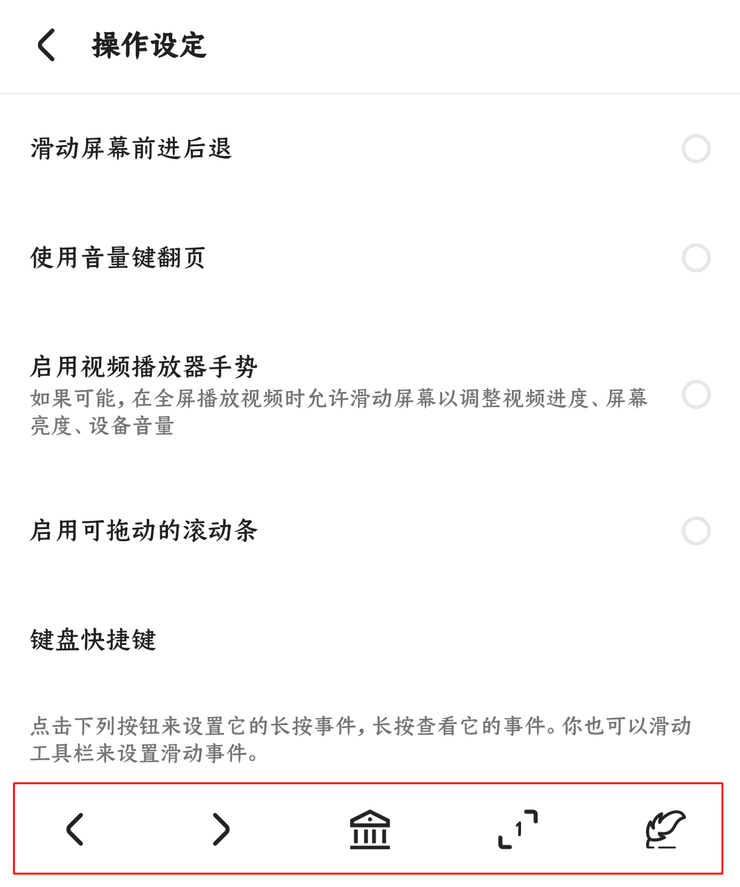
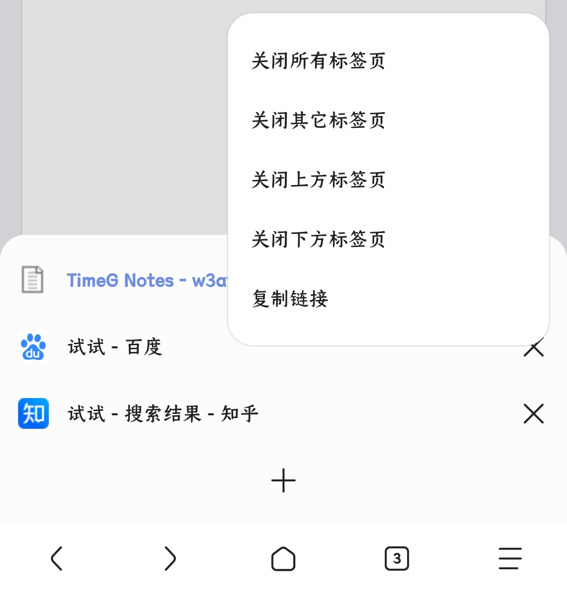
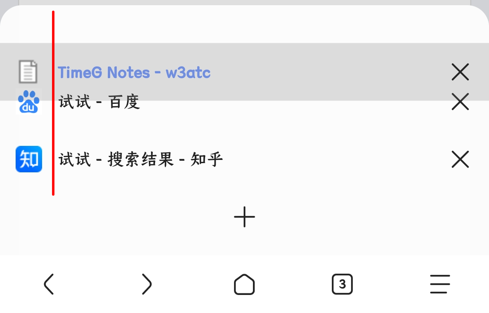
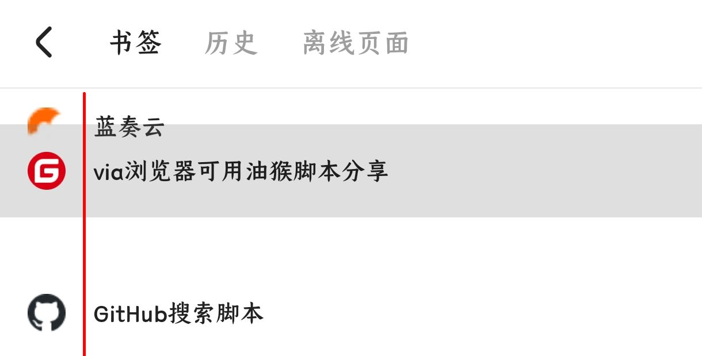
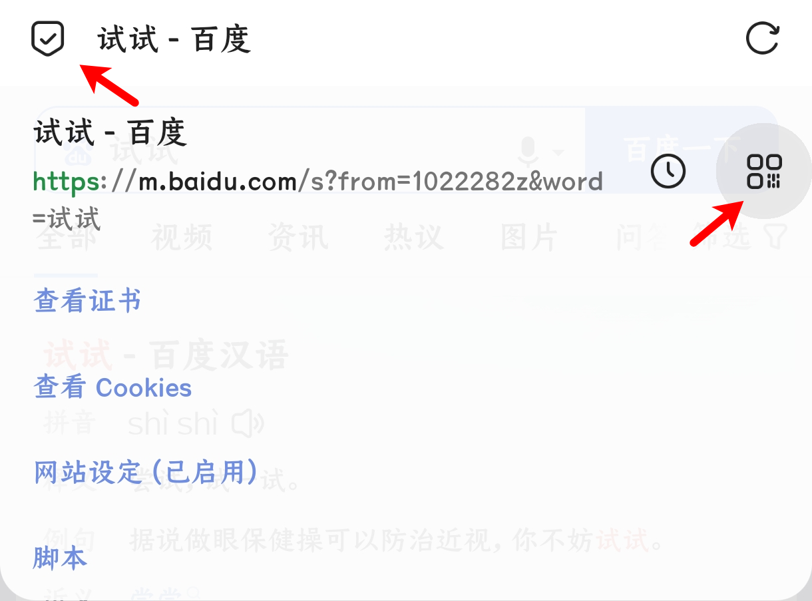
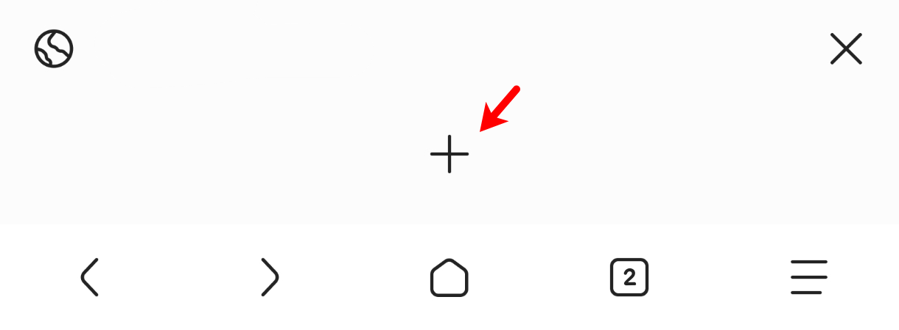
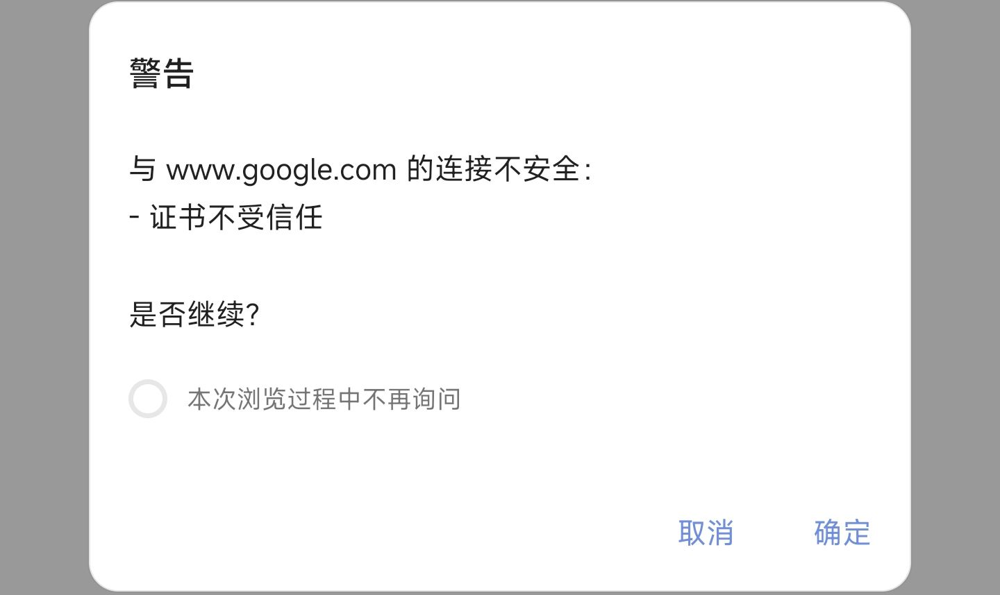
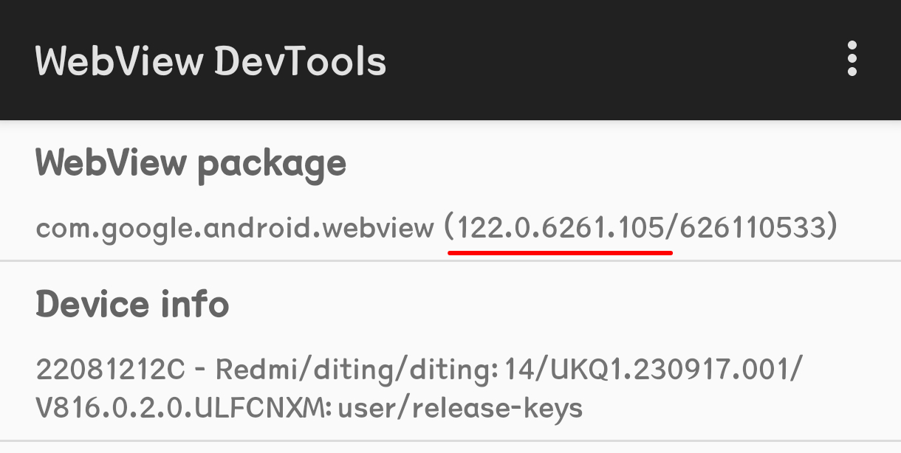

# via小功能或冷门知识

## 💡via设置

### ✧操作设定✧

via大部分手势都是在 设置＞通用＞操作设定内



下方的工具栏各个按钮均可长按来更改功能，也可以整个工具栏左右滑动

同时，这里功能也是比较丰富，如：

“滑动屏幕前进后退”，如果手势冲突就可以关了

“使用音量键翻页”，看小说漫画或许有奇效？

“启用可拖动的滚动条”(5.5.0去掉了设置，一直是启用状态)

### ✧菜单内长按功能✧

大多图标都是有长按快捷键，这里列举主要的：

<details>
  <summary> ©展开部分按钮的长按功能介绍 </summary>

- 长按“设置”进入“定制菜单”界面

(普通方式 点击菜单中的“定制菜单” 或 设置＞通用＞定制菜单)

- 长按“电脑模式”可以切换“浏览器标识”

(普通方式 点击菜单中的“浏览器标识”)

- 长按“浏览器标识”进入“浏览器标识”界面

(普通方式 设置＞通用＞浏览器标识)

- 长按“工具箱”进行“资源嗅探”

(普通方式 点击菜单中的“资源嗅探”)

- 长按“添加书签”将网站“添加到桌面”

(普通方式 点击菜单中的“添加到桌面”)

- 长按“标记广告”/“网络日志”进入“自定义规则”界面

(普通方式 设置＞通用＞广告拦截＞自定义规则)

- 长按“翻译”打开翻译菜单，用于切换其他翻译方式

(普通方式 正常翻译失败后会打开)

(↓5.4.0更新)

- 长按“阅读模式”可以打开阅读设置

(普通方式 设置＞通用＞阅读模式)

- 长按地址栏左侧图标选择“搜索引擎”

</details>

### ✧隐蔽的设置✧

<details>
  <summary> ©展开图文介绍 </summary>

1. 标签栏内长按标签



2. 标签左侧长按拖动



3. 大书签页左侧长按拖动



4. 网页转二维码

点击地址栏左侧图标，然后点击如图的二维码图标



5. 自定义阅读模式CSS

使用方法(三种，不是三步)：

①设置＞通用＞阅读模式＞自定义阅读模式css

②阅读模式下长按阅读模式设置里的“更多选项”

③非阅读模式下长按菜单中的“阅读模式”，点击“自定义阅读模式css”(菜单中没找到阅读模式就长按菜单中的“设置”，将“阅读模式”拖入)

<details><summary>©阅读模式CSS简易使用教程</summary>


```

/*💾阅读模式主体*/
.via-reader-body{
/*↓网页字体改为默认↓*/
font-family:initial !important;
}
/*💾阅读模式头部整体*/
.via-reader-header{
/*↓调整边距(两条)↓*/
padding:0;
margin-bottom:0;
}
/*💾阅读模式头部-标题*/
.via-reader-header>h1{
/*↓让标题只显示一行(三条)↓*/
overflow:hidden;
white-space:nowrap;
text-overflow:ellipsis;
}
/*💾阅读模式头部-域名*/
.via-reader-header>div:not(a){
/*不知道有什么能改的，先放着*/
}
/*💾阅读模式头部-上一页、目录、下一页*/
.via-reader-header>div>a{
color:red !important;
/*↓去掉下划线↓*/
text-decoration:none !important;
padding:10px 0;
}
/*💾阅读模式内容*/
.via-reader-content{
/*↓限制宽度↓*/
width:92vw !important;
/*↓添加边框↓*/
border:1px solid grey;
/*↓调整边距(两条)*/
margin:20px auto 80px;
padding:10px;
}
/*💾阅读模式内容-调整文字边距*/
.via-reader-content>p{
margin:0;
padding:10px 0;
}
/*💾让文字两端对齐*/
#readability-page-1 > div > p{
text-align:justify !important;
}
/*💾尝试去掉内部边框*/
.via-reader-content *{
box-shadow:0px !important;
border:0 !important;
}
/*💾阅读模式内容-上一页、目录、下一页*/
.via-reader-content>p>a{
color:red !important;
}

```


</details>

</details>

<br>

🤔特立独行的功能位置↓

> 设置＞高级＞自动展示嗅探按钮

> 设置＞通用＞字体大小＞强制缩放

> 设置＞通用＞广告拦截＞自动展开网页全文

> 历史，左下角点击“标签页”(可以查看最近关闭的标签)<br><details><summary> ©查看快捷键 </summary>长按添加标签(如图)的地方即可直接打开<br> </details>

*****

## 💡地址栏新大陆(Scheme)

将下列东西粘贴到地址栏搜索会有奇妙的事情发生哦~

<details>
  <summary> ©展开列表 </summary>

- 大书签页(书签部分)
> javascript:via.cmd(257)

- 大书签页(历史部分)
> v://history _或_ via://history

- 翻译菜单 
> javascript:via.cmd(513)

- 聚焦地址栏 
> javascript:via.cmd(514)

- 标记广告 
> javascript:via.cmd(517)

- via功能页 
> v:// _或_ via://

- 沉浸式书签页(实际上就是文件地址)
> file:///data/user/0/mark.via/files/bookmarks.html

- 沉浸式历史页 
> history//

- 沉浸式离线页 
> v://offline _或_ via://offline

- 小窗口书签页 
> folder://

- 在主页时是小窗口书签页，在其他网页是沉浸式书签页
> v://bookmarks _或_ via://bookmarks

- 图标包切换页 
> v://skins _或_ via://skins

- 使用扫码功能 
> v://scanner _或_ via://scanner

- 打开下载页
> v://downloader _或_ via://downloader

- 调用via搜索(基本是开发者用的)
> v://search _或_ via://search

- 调用via搜索任意关键词(喜欢折腾的可以试试，用外部软件调用via)
> v://search?q=任意关键词 _或_ via://search?q=任意关键词

[官方介绍Scheme文档](https://viayoo.com/zh-cn/docs/about-the-uri-scheme-of-via-for-android.html)

</details>

*****

## 💡问答专区

1.via浏览器触发异常问题？

> 设置＞关于，点击via的logo滑到最底下查看最新的log报错<br>如果滑不到底可以在此页面点击右上角分享，用其他软件查看 _log.txt_ <br>注意：别长按via的logo，长按后会跳转打开webview自带的开发者工具

2.进入某些网页总是有不安全弹窗？

> 设置＞高级＞忽略SSL证书警告，该功能主要是用于提醒站点是否证书齐全



3.如何查询系统webview版本号？

> 设置＞关于，长按via的logo就可以打开webview的开发者工具，如下图所示就是webview版本号(⚠注意：如果是华为系设备可能无法长按，按默认最新版的HUAWEI webview可对应Android webview的99版本)



4.网页版式错误？

> 先尝试关闭脚本、关闭广告拦截、浏览器标识换为默认能否解决，如能，再细化排查即可；如不能，可再尝试前往Google商店更新webview→[谷歌商店里的webview](https://play.google.com/store/apps/details?id=com.google.android.webview)

🤔其他问题可以尝试看看下方的官方问答区

*****

## 💡有关via的其他推荐

- [via浏览器可用脚本推荐](script-share.md)

- [广告拦截规则+浏览器标识+图标包等](messy-cont.md)

- [(官方问答)Android版via常见问题文档](https://viayoo.com/zh-cn/docs/via-for-android-faq.html)

- [via浏览器的QQ频道](https://pd.qq.com/s/142yif2dj)

*****

[返回主页](README.md).via-reader-content *{
box-shadow:0px !important;
border:0 !important;
}
/*💾阅读模式内容-上一页、目录、下一页*/
.via-reader-content>p>a{
color:red !important;
}

```


</details>

</details>

<br>

🤔特立独行的功能位置↓

> 设置＞高级＞自动展示嗅探按钮

> 设置＞通用＞字体大小＞强制缩放

> 设置＞通用＞广告拦截＞自动展开网页全文

> 历史，左下角点击“标签页”(可以查看最近关闭的标签)<br><details><summary> ©查看快捷键 </summary>长按添加标签(如图)的地方即可直接打开<br> </details>

*****

## 💡地址栏新大陆(Scheme)

将下列东西粘贴到地址栏搜索会有奇妙的事情发生哦~

<details>
  <summary> ©展开列表 </summary>

- 大书签页(书签部分)
> javascript:via.cmd(257)

- 大书签页(历史部分)
> v://history _或_ via://history

- 翻译菜单 
> javascript:via.cmd(513)

- 聚焦地址栏 
> javascript:via.cmd(514)

- 标记广告 
> javascript:via.cmd(517)

- via功能页 
> v:// _或_ via://

- 沉浸式书签页(实际上就是文件地址)
> file:///data/user/0/mark.via/files/bookmarks.html

- 沉浸式历史页 
> history//

- 沉浸式离线页 
> v://offline _或_ via://offline

- 小窗口书签页 
> folder://

- 在主页时是小窗口书签页，在其他网页是沉浸式书签页
> v://bookmarks _或_ via://bookmarks

- 图标包切换页 
> v://skins _或_ via://skins

- 使用扫码功能 
> v://scanner _或_ via://scanner

- 打开下载页
> v://downloader _或_ via://downloader

- 调用via搜索(基本是开发者用的)
> v://search _或_ via://search

- 调用via搜索任意关键词(喜欢折腾的可以试试，用外部软件调用via)
> v://search?q=任意关键词 _或_ via://search?q=任意关键词

[官方介绍Scheme文档](https://viayoo.com/zh-cn/docs/about-the-uri-scheme-of-via-for-android.html)

</details>

*****

## 💡问答专区

1.via浏览器触发异常问题？

> 设置＞关于，点击via的logo滑到最底下查看最新的log报错<br>如果滑不到底可以在此页面点击右上角分享，用其他软件查看 _log.txt_ <br>注意：别长按via的logo，长按后会跳转打开webview自带的开发者工具

2.进入某些网页总是有不安全弹窗？

> 设置＞高级＞忽略SSL证书警告，该功能主要是用于提醒站点是否证书齐全


3.如何查询系统webview版本号？

> 设置＞关于，长按via的logo就可以打开webview的开发者工具，如下图所示就是webview版本号(⚠注意：如果是华为系设备可能无法长按，按默认最新版的HUAWEI webview可对应Android webview的99版本)


4.网页版式错误？

> 先尝试关闭脚本、关闭广告拦截、浏览器标识换为默认能否解决，如能，再细化排查即可；如不能，可再尝试前往Google商店更新webview→[谷歌商店里的webview](https://play.google.com/store/apps/details?id=com.google.android.webview)

🤔其他问题可以尝试看看下方的官方问答区

*****

## 💡有关via的其他推荐

[via浏览器可用脚本推荐](https://github.com/daybreak1929/ViaBrowserCollection/blob/main/README.md)

[广告拦截规则+浏览器标识+图标包等](https://github.com/daybreak1929/ViaBrowserCollection/blob/main/messy-cont.md)

[(官方问答)Android版via常见问题文档](https://viayoo.com/zh-cn/docs/via-for-android-faq.html)

[via浏览器的QQ频道](https://pd.qq.com/s/142yif2dj)
